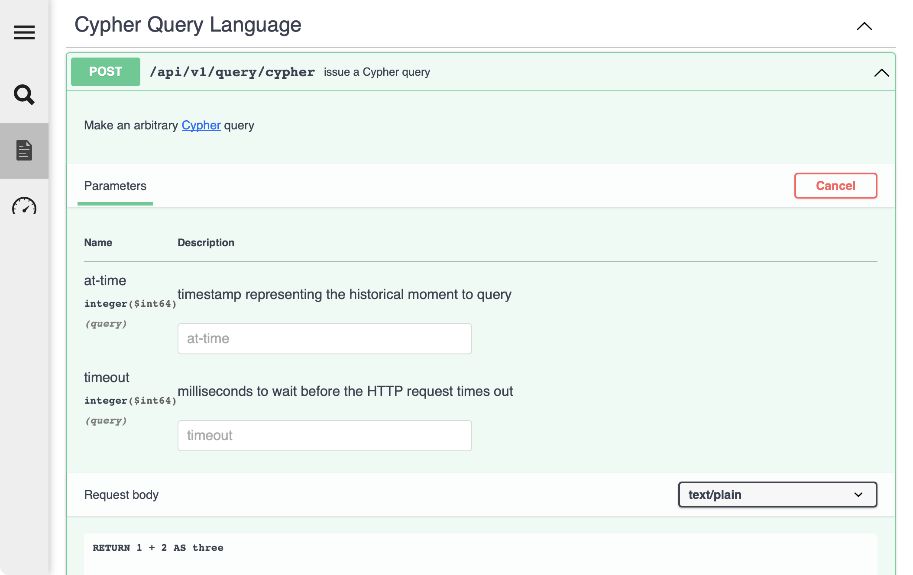
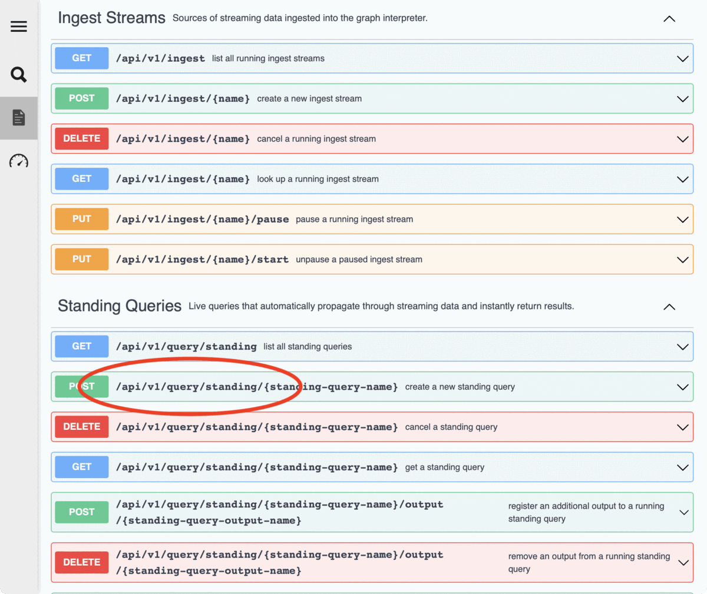

# REST API

The REST API is accompanied by a @link:[Swagger UI](https://swagger.io/tools/swagger-ui/){ open=new } served by the web server at `/docs` that lists out all of the endpoints, how to call them, and some inline descriptions of what they do. The UI even makes it possible to interactively try out endpoints by filling in text fields and clicking buttons.

For instance, on that page, just under the **Cypher query language** section, you can click on the green box containing `POST /api/v1/query/cypher issue a Cypher query` to expand out the interactive panel. Now, you can see more details about this endpoint as well as try it out interactively by clicking on the "**Try it out**" button, optionally editing the query, and then clicking on the **Execute** button.

This entire page is powered by an OpenAPI specification of our API (the raw version which is accessible at `/docs/openapi.json`). This specification can also be used by users to generate client programs that call the API in the correct format, see @link:[this page](https://openapi-generator.tech/){ open=new } for more details.

This interactive documentation also includes a detailed specification of every API, describing all optional and required values, and showing what the possible options are. You can find this information in the "Schema" section of each individual API endpoint. Click any endpoint, and _WITHOUT clicking the "**Try it out**" button_, choose the "**Schema**" option in the "Request Body" section next to the "Example Value" option. The text changes to show an expandable hierarchy of options available for the request body. In some of the API endpoints (like Standing Queries or Ingest Streams) these options can be very complicated and detailed, with many options available. All available options are shown in this "Schema" section.

