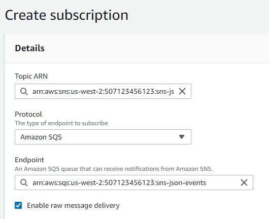

# AWS SNS and SQS Support

AWS SNS (Simple Notification Service) acts as a broadcast hub for notifications that can be delivered over multiple channels such as texting (SMS), email, or programmatic queues. AWS SQS (Simple Queue Service) is one such programmatic queue, which can act as a recipient for SNS messages or be used as a standalone message queuing service. Quine can interact with SNS and SQS by publishing Standing Query results to an SNS topic, or by reading messages (records) from an SQS queue.

## Using SQS to Read Records From SNS

Both SNS and SQS can be used in conjunction with Quine to ingest messages published to an SNS topic. In order to do so, simply register a new SQS queue as a subscriber to the SNS topic via the @link:[SNS console](https://console.aws.amazon.com/sns/v3/home#/create-subscription){ open=new }, being sure to check the "enable raw message delivery" box. Then, ingest from SQS as described in the SQS section of this page.



## Reading Records from SQS

Quine has full support for reading records from SQS Queues. The means by which Quine interprets a record into some graph-structured data is highly configurable via the @ref:[REST API](../../reference/rest_api.md).

### SQS Ingest Example

In this example, we will register an SQS queue as a data source, creating a single node in the graph for each object, and acknowledging receipt of each record from SQS to dequeue it.

#### Preparation for SQS Ingest

For the purposes of this tutorial, you will need @link:[an SQS queue](https://console.aws.amazon.com/sqs/v2/home#/create-queue){ open=new } and credentials (an access key ID and secret access key) for an @link:[IAM User](https://console.aws.amazon.com/iam/home?#/users$new?step=details){ open=new } with the following @link:[privileges](https://docs.aws.amazon.com/IAM/latest/UserGuide/list_amazonsqs.html){ open=new } for that queue:

 - sqs:ReceiveMessage
 - sqs:DeleteMessage
 - sqs:DeleteMessageBatch
 - sqs:ChangeMessageVisibility
 - sqs:ChangeMessageVisibilityBatch
 - sqs:GetQueueAttributes

For our example, we'll assume there is such a user with access to the `json-events` stream with access key ID `AKIAMYACCESSKEY` and secret `AWSScRtACCessKeyAWS/ScRtACCessKey`. These will be used to register the data source with Quine. We'll assume the queue has the URL `https://sqs.us-west-2.amazonaws.com/507123456123/json-events` and contains JSON-encoded data.

#### Registering SQS as a data source

To register SQS as a data source to Quine, we need to describe our queue via the ingest @ref:[REST API](../../reference/rest_api.md).

For example, we'll use the previously-described `json-events` queue, and we'll give the Quine ingest stream the name `main-queue`. Thus, we make our API request a POST to `/api/v1/ingest/main-queue` with the following payload:

```json
{
  "type": "SQSIngest",
  "queueUrl": "https://sqs.us-west-2.amazonaws.com/507123456123/json-events",
  "format": {
    "query": "CREATE ($that)",
    "type": "CypherJson"
  },
  "credentials": {
    "region": "us-west-2",
    "accessKeyId": "AKIAMYACCESSKEY",
    "secretAccessKey": "AWSScRtACCessKeyAWS/ScRtACCessKey"
  },
  "deleteReadMessages": true
}
```

Because the SQS queue is filled with JSON records, we choose the `CypherJson` import format, which reads each record as a JSON object before passing it as a `Map` to a Cypher query. The Cypher query can access this object using the name `that`. Thus, our configured query `CREATE ($that)` will create a node for each JSON record with the same property structure as the JSON record.

We also choose to acknowledge receipt of each message successfully read off the queue, and thus set "deleteReadMessages" to true (this is the default!) If we wanted to read messages off the SQS queue, but leave them in the queue for SQS to re-issue to other consumers later, we would set deleteReadMessages to false.

## Writing Results to SNS

Quine also supports writing @ref:[Standing Query](../standing_query_outputs.md) results to AWS SNS.

### SNS Write Example

In this example, we will register an SNS topic as a target for Standing Query matches, issuing a single message for each match.

#### Preparation for SNS Output

You will need @link:[an SNS topic](https://console.aws.amazon.com/sns/v3/home#/homepage){ open=new } and credentials (an access key ID and secret access key) for an @link:[IAM User](https://console.aws.amazon.com/iam/home?#/users$new?step=details){ open=new } with the `sns:Publish` @link:[privilege](https://docs.aws.amazon.com/IAM/latest/UserGuide/list_amazonsns.html){ open=new } for that topic. For this example, we'll assume the same user (with access key `AKIAMYACCESSKEY`) has sufficient privileges for a topic `sns-json`

#### Registering SNS as a Standing Query Output

To register SNS as a Standing Query output, we need to describe our output via the @ref:[REST API](../../reference/rest_api.md){ open=new }.

We'll use the topic `sns-json` with ARN `arn:aws:sns:us-west-2:507123456123:sns-json` and associate the output with an already-running Standing Query `match-usernames`. Thus, we'll make a POST request to `/api/v1/query/standing/match-usernames/output` with the following body:

```json
{
  "type": "WriteToSNS",
  "topic": "arn:aws:sns:us-west-2:507123456123:sns-json",
  "credentials": {
    "region": "us-west-2",
    "accessKeyId": "AKIAMYACCESSKEY",
    "secretAccessKey": "AWSScRtACCessKeyAWS/ScRtACCessKey"
  }
}
```

Note that as with all Standing Query outputs, this output could be registered on a new Standing Query or an already-running Standing Query.