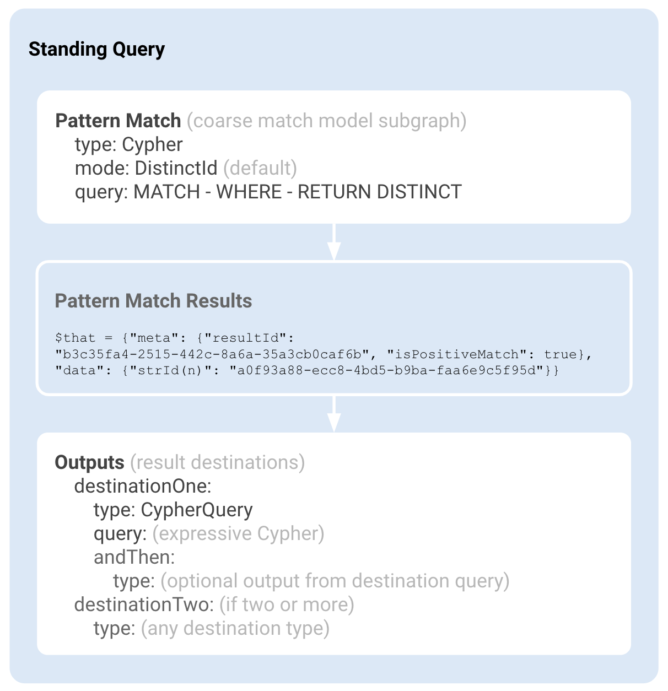

# Standing Queries

A standing query is a feature unique in Quine to incrementally `MATCH` a subgraph as new data enters the graph. Then, when a full subgraph matches, the result is further processed to modify the graph, produce output as a data source, or take additional action.

## Standing Query Structure

Standing queries have two parts: a **pattern** query and **outputs** destinations. The pattern query defines the structure of what we're looking for, and output destinations specify actions for each result produced.

Consider the pattern query as a coarse filter that is specific enough to `MATCH` a model event but not so specific that it would match a unique event. A query in an output destination can process the result further with a more expressive Cypher query to then update the graph, act as an event source, generate metrics, and much more.

Cypher within a pattern query must only contain a `MATCH` and a `RETURN`, with an optional `WHERE`, while Cypher within output destinations is unconstrained, allowing for more expressive queries.



As described in the [Create Standing Query](https://docs.quine.io/reference/rest-api.html#/paths/api-v1-query-standing-standing-query-name/post) API documentation, a standing query is created via POST to the `/api/v1/query/standing/{standing-query-name}` endpoint.

```json title="POST /api/v1/query/standing/STANDING-1"
{
  "pattern": {
    "type": "Cypher",
    "query": "MATCH (n) RETURN DISTINCT id(n) AS id"
  },
  "outputs": {
    "destination": {
      "type": "CypherQuery",
      "query": "MATCH (n) WHERE id(n) = $that.data.id RETURN n.line",
      "andThen": {
        "type": "PrintToStandardOut"
      }
    }
  }
}
```

Or in YAML if you are writing a recipe.

``` yaml
standingQueries:
  - pattern:
      type: Cypher
      query: MATCH (n) RETURN DISTINCT id(n) AS id
    outputs:
      destination:
        type: CypherQuery
        query: >-
          MATCH (n)
          WHERE id(n) = $that.data.id
          RETURN n.line
        andThen:
          type: PrintToStandardOut
```

This structure ensures that the set of positive matches, minus the set of negative matches (also referred to as **cancellations**) produced by a standing query are like the results produced if the same Cypher query had been issued in a batch fashion after all data has been written into the graph.

## Pattern Match Query

The pattern query in a standing query is a declarative graph pattern expressed using a subset of the Cypher query language containing a `MATCH` and a `RETURN`, with an optional `WHERE`.

### Distinct ID Pattern Queries

Quine has two modes available for writing pattern queries, `DistinctId`, and `MultipleValues`. The mode is set to `DistinctId` by default unless you explicitly set the mode to `MultipleValues` within your pattern query. Quine can process standing queries that contain either mode within the same runtime or recipe.

The following constraints apply to Cypher contained in the pattern `query` string when `mode` is set to the default `DistinctId`:

  1. Each node identified by the `MATCH` shall have the following:
  1. Node variable name
  2. Label (optional but not more than one)
  3. Optional map of literal property values to match

  2. Nodes in the `MATCH` must form a @link:[connected graph](https://en.wikipedia.org/wiki/Connectivity_(graph_theory)).

  3. Nodes in the `MATCH` must **not** contain any cycles. In other words, the pattern must be either linear or tree-shaped.

  4. Only node variables can be bound in the query `MATCH`. Edges **cannot** be aliased to a variable, and path expressions cannot be used (so `-[:has-father]->` is fine, but `-[e:has-father]->` is not).

  5. Edges in the `MATCH` must be directed, have exactly one edge label, and **cannot be variable-length**.

  6. Constraints inside the `WHERE` clause must be `AND`-ed together and of one of the following forms:

     * `nodeName.property = 123` - the property has the literal value on the right
     * `nodeName.property <> 123` - the property must exist but be different than the literal value on the right
     * `nodeName.property IS NOT NULL` - the property must exist
     * `nodeName.property IS NULL` - the property must not exist
     * `nodeName.property =~ "regex"` - the property must be a string matching the regex
     * `strId(nodeName) = "1234"` - the string version of the ID of the node must be exactly the literal value on the right
     * `strId(nodeName) = idFrom('values', 'to', 'hash')` - the ID of the node must match exactly the `idFrom()` computed from the literal values on the right

  7. Exactly **one** value must be returned, and it must be either the `DISTINCT` `id` or `strId` of a node bound in the `MATCH`.
  
  For example, `RETURN DISTINCT strId(n)` or `RETURN DISTINCT id(n) as nId` are OK, but not `RETURN n.name` or `RETURN id(n) AS nId`. The node whose id is returned is the root node - the location in the graph from which the pattern starts being incrementally matched.

### MultipleValue Pattern Queries (Beta)

@@@ warning { title='Beta Feature' }

This feature is in the beta phase of development.

Pattern queries with `MultipleValues` mode could:

* Require syntax changes when the feature releases as GA
* Use more RAM
* Consume more disk space
* Differ in performance from Distinct ID pattern query queries

@@@

`MultipleValue` mode pattern query queries relax some of the constraints imposed by `DistinctId`. In particular, the `WHERE` and `RETURN` portions of the query allow Cypher expressions to be much more expressive.

The syntax and structure of this mode is designed to supersede the `DistinctId` mode. Thus, any `DistinctId` standing query pattern is a valid `MultipleValues` standing query, though not the other way around.

The `MultipleValues` mode retains the `MATCH` - `WHERE` - `RETURN` shape from `DistinctId` mode with the addition of the constraints below.

  1. Any number of results (not just one) can be returned in the `RETURN`, including results that aren't node IDs
  2. Constraints in the `WHERE` clause are reduced
  3. `DISTINCT` is required for `DistinctId` standing queries, but the `MultipleValues` mode does not support `DISTINCT` return values.
  4. Use of variables must represent a node
  5. Variable usage is ok when dereferencing node properties. For example `RETURN n.name` is ok but `RETURN n` is not.
  6. `WHERE` and `RETURN` support `id(n)` and `strId(n)` but other functions are not supported.

The `MATCH` portion of standing queries using the `MultipleValues` mode removes the syntactic requirements for running in `DistinctId` mode with two exceptions:

  1. Multiple IDs and property values from matched nodes can be returned by `RETURN`. For example, `RETURN n.age + 3, strId(n) + " " + m.name` is fine, but `RETURN properties(n)` is not.

  2. Constraints in the `WHERE` clause must be defined in the IDs and properties of matched nodes and can not include sub-queries or procedures.
  3. Can not `MATCH` variable length patterns
  4. `MATCH` does not support pattern expressions

Since there isn't exactly one ID being returned, the root of the standing query pattern (the place in the pattern from which incremental matching starts) is instead set to be the first node in the `MATCH` pattern. This makes it possible to make any node in the pattern the "root".

### Pattern Match Results

Both modes for the pattern query return a `StandingQueryResult` JSON object with `meta` and `data` sub-objects.

The `meta` JSON sub-object consists of the following:

* `isPositiveMatch`: whether the result is a new match. When this value is false, it signifies that a previously matched result no longer matches

* `resultId`: a UUID generated for each result. This is useful if you wish to track a result in some external system since the `resultId` of the result with `isPositiveMatch = false` will match the `resultId` of the original result (when `isPositiveMatch = true`).

The `data` JSON sub-object consists of the following:

* On a positive match, the `data` JSON object contains results returned by the pattern query.
* This objects keys are the names of the values returned (ex: `RETURN DISTINCT strId(n)` would have key `"strId(n)"` and `RETURN DISTINCT id(n) AS theId` would have key `"theId"`).
* Each query data returned is analogous to a row returned from a regular Cypher query - the key names match what would normally be Cypher column names.

When `DistinctId` `mode` is set, a result is emitted when a complete pattern matches or stops matching, but additional results won't be emitted if there are interim new complete pattern matches.

@@@ note { title='Example of single-result per root semantics' }

Consider the following query for watching friends.

```cypher
// Find people with friends
MATCH (n:Person)-[:friend]->(m:Person)
RETURN DISTINCT strId(n)
```

If we start by creating disconnected "Peter", "John", and "James" nodes, there will be no matches.

```cypher
CREATE (:Person { name: "Peter" }),
       (:Person { name: "John" }),
       (:Person { name: "James" })
```

Then, if we add a "friend" edge from "Peter" to "John", "Peter" will trigger a new standing query match.

```cypher
MATCH (peter:Person { name: "Peter" }), (john:Person { name: "John" })
CREATE (peter)-[:friend]->(john)
```

However, adding a second "friend" edge from "Peter" to "James", "Peter" will not trigger a new match since he is already matching (that is, the "Peter" node is not distinct).

```cypher
MATCH (peter:Person { name: "Peter" }), (james:Person { name: "James" })
CREATE (peter)-[:friend]->(james)
```

**Note**, unlike `DistinctId` mode queries, `MultipleValues` mode pattern query results can be emitted from each root node. This means that the "Find people with friends" example, if run in the `MultipleValues` mode, would produce two results (one for each friend) unlike the single result produced in the `DistinctId` mode.

@@@

Sample `StandingQueryResult`:

```json
{
    "meta": {
        "resultId": "b3c35fa4-2515-442c-8a6a-35a3cb0caf6b",
        "isPositiveMatch": true
    },
    "data": {
        "strId(n)": "a0f93a88-ecc8-4bd5-b9ba-faa6e9c5f95d"
    }
}
```

## Result Outputs

Once a full pattern match occurs, a `StandingQueryResult` is produced. A standing query can have any number of output destinations to route `StandingQueryResults`. The output destinations are processed in parallel.

### Cypher Query

The Cypher query is particularly powerful, making it possible to post-process pattern query results to collect more information from the graph or to filter out matches that don't meet some requirements.

The `StandingQueryResult` object is passed the standing query output via the parameter `$that`, for use in `query` Cypher.

When running a Cypher query as the standing query output, the user can pass in another output step using the `andThen` field. This field can include any output options described here, even additional Cypher Query steps.

Be aware that non-trivial or long-running operations with `StandingQueryResults` will consume system resources and cause the system to backpressure and slow down other processing (like data ingest).

### Drop

Drop the current `StandingQueryResult` output and end processing the destination.

### POST to Webhook

Makes an HTTP[S] POST for each `StandingQueryResult`. The data in the request payload can be customized in a Cypher query preceding this step.

### Publish to Slack

Sends a message to Slack via a configured Slack App webhook URL. See @link:[https://api.slack.com/messaging/webhooks](https://api.slack.com/messaging/webhooks){ open=new }.

Slack limits the rate of messages which can be posted; limited to 1 message per second at the time of writing. Quine matches that rate-limit internally by aggregating `StandingQueryResult`s together if they arrive faster than can be published to Slack. The aggregated results will be published as a single message to Slack when the rate-limit allows.

### Log JSON to Standard Out

Prints each result as a single-line JSON object to standard output on the Quine server.

This output type can be configured with `Complete` to print a line for every `StandingQueryResult`, backpressuring and slowing down the stream as needed to print every result.

Or it can be configured with `FastSampling` to log results in a best effort, by dropping some results to avoid slowing down the stream.

Note that neither option changes the behavior of other StandingQueryResultOutputs registered on the same standing query.

### Log JSON to a File

Write each `StandingQueryResult` as a single-line JSON object to a file on the local filesystem.

### Publish to Kafka Topic

Publishes a record for each `StandingQueryResult` to the provided Apache Kafka topic. Records can be serialized as JSON or Protocol Buffers before being published to Kafka.

### Publish to Kinesis Stream

Publishes a record for each `StandingQueryResult` to the provided Kinesis stream. Records can be serialized as JSON or Protocol Buffers before being published to Kinesis.

### Publish to SNS Topic

Publishes an AWS SNS record to the provided topic containing JSON for each result. For the format of the result, see "Standing Query Result Output".

**Ensure your credentials and topic ARN are correct.** If writing to SNS fails, the write will be retried indefinitely. If the error is unfixable (e.g.: the topic or credentials cannot be found), the outputs will never be emitted and the Standing Query this output is attached to could stop running.

## Inspecting Running Queries

Since pattern query queries use a subset of regular Cypher query syntax, the match query itself can be run as a regular query either to see what data already in the graph would have been matched by the query or to understand why a particular node in the graph is not a match.

When doing so, you should constrain the starting points of the query if there is already a large amount of data in the system (see @ref:[Using IDs in a Query](id-provider.md)).

In addition, Quine provides ways to stream results as they are being produced and inspect them live.

### `standing.wiretap` Cypher procedure

From the @ref:[Exploration UI](../getting-started/exploration-ui.md), the `standing.wiretap` Cypher procedure can issue a query that will incrementally return results. Since this is just a regular, Cypher procedure, it can feed its outputs automatically into another query too.

For example:

```cypher
// Wiretap "hasMaternalGrandpaJoe" and return properties of matching nodes
CALL standing.wiretap({ name: "hasMaternalGrandpaJoe" }) YIELD meta, data
WHERE meta.isPositiveMatch
MATCH (n) WHERE id(n) = data.id
RETURN properties(n)
```

Then, you will see results incrementally appear as they match. When you are satisfied, you can cancel the query.

@@@ warning

The `standing.wiretap` procedure only stops running if the standing query is canceled (since otherwise, it can never be certain that there won't be more forthcoming match results). This means that it is risky to use the procedure in the Cypher REST API or in other places where results are not reported incrementally and queries cannot be canceled.

@@@


### Results API Endpoint

Quine can produce wiretap results outside of the Exploration UI (and without going through the `standing.wiretap` Cypher procedure) by using the server side events (SSE) endpoint `/api/v1/query/standing/{standingQueryName}/results`.

The endpoint will surface new matches as they are produced. Connecting a Chrome web browser, for example, will append new results to the bottom of the page as they become available.

Alternatively, `curl` will print out new results as they arrive in a terminal window.

```bash
$ curl http://localhost:8080/api/v1/query/standing/hasMaternalGrandpaJoe/results
data:

data:

data:{"data":{"id":"2756309260014435"},"meta":{"isInitialResult":true,"ispositivematch":true,"resultId":"8f408026-8fb3-3955-c81a-7259175f41b8"}}
event:result
id:8f408026-8fb3-3955-c81a-7259175f41b8

data:{"data":{"id":"7945274922095468"},"meta":{"isInitialResult":true,"isPositiveMatch":true,"resultId":"6a83dda3-08a1-e085-ee7d-14138398f336"}}
event:result
id:6a83dda3-08a1-e085-ee7d-14138398f336

data:{"data":{"id":"6994090876991233"},"meta":{"isInitialResult":true,"isPositiveMatch":true,"resultId":"59b215b4-4084-b5bb-379d-9654bb2a7c83"}}
event:result
id:59b215b4-4084-b5bb-379d-9654bb2a7c83

data:
```

Using the output above, it is possible to query the matching nodes directly with a Cypher query.

For instance, we can go look for current children of some of the matches the SSE output above tells us we found:

```cypher
// Query for children of nodes with IDs from the SSE endpoint above
UNWIND [2756309260014435, 7945274922095468, 6994090876991233] AS personId
MATCH (person)<-[:has-mother|:has-father]-(child) WHERE id(person) = personId
RETURN person.name, child.name, child.yearBorn
```
