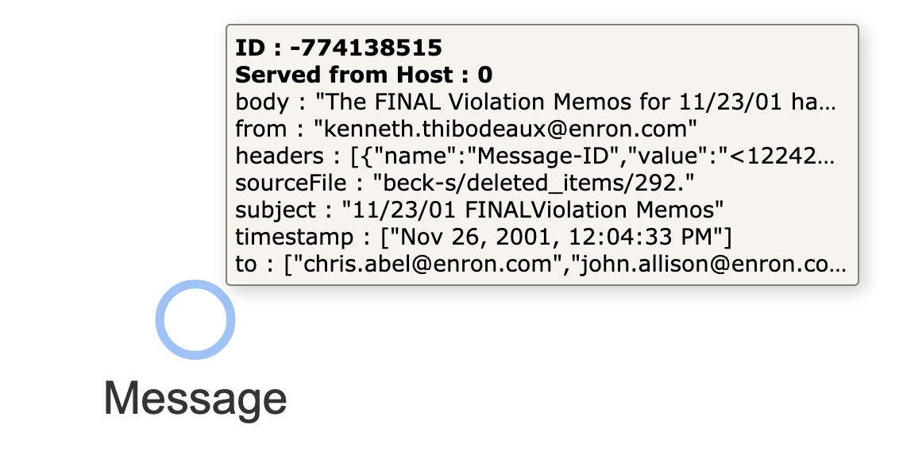

# Processing an Event Stream

Finding complex patterns in streaming data often requires creating new elements that represent new types, composite values, judgments, or metrics. As new data streams in, these patterns are recognized immediately by standing queries and used to create more meaningful data elements tied to their underlying original data.

The result is:

* An interconnected graph of original data loaded into the system
* Associated new data which is smaller in size, but more meaningful
* Many possible “interpretations” of data living together happily in a streaming system

```raw
<video width="688" height=516 autoplay playsInline muted loop>
<source src="3d-data/3d_data.m4v" type="video/mp4" />
Your browser does not support video playback.
</video>
```

In this exploration, we will consume the public dataset of Enron email messages (500,000+ emails from 150 individuals released as part of Enron's prosecution for fraud) .

Email is ubiquitous and forms a natural web of interlinked data. However, the records in the dataset are just simple, raw email messages. In this exploration, we demonstrate how to read and store the original data, connect it into an interesting structure, and produce new data that builds toward answers of interest.

## Step #1: Plan for incoming data structure

The original dataset is in CSV format with the following columns:

```csv
"file", "message"
```

The `message` column from the original data set is all that interests us for this exploration.

For convenience, the dataset has been preprocessed and made available as a line-based JSON file [enron.json.zip](https://thatdot-public.s3.us-west-2.amazonaws.com/enron.json.zip) (385MB compressed, 1.6GB unzipped) with the following structure:

```json
{
  "sourceFile": "",
  "headers": [
    {
      "name": "",
      "value": ""
    }
  ],
  "from": "",
  "to": [],
  "subject": "",
  "timestamp": [],
  "body": ""
}
```

For the ingest steps below, we will make each message a node in a graph. The node ID will be deterministically generated from the email metadata. All JSON fields are stored on the node as key/value pairs (or “properties”) on the respective node. For convenience, each node will be given a label of “Message”.

This ingest plan will create a single node for each email message, entirely disconnected from any other node in the graph. This structure is directly analogous to each email message representing one row of a relational database, where the columns are the JSON object keys.

This can be accomplished with the following Cypher query used to ingest each JSON data record passed in as `$that`:

```cypher
MATCH (n)
WHERE id(n) = idFrom('message', $that.from, $that.to, $that.timestamp)
SET n = $that, n:Message
```

## Step #2: Set Standing Queries

_Quine_ has the unique ability to set a query which lives inside the graph, propagates automatically, and can trigger arbitrary action immediately for each result found when new data completes the query. standing queries can be applied to existing data, or only to new data coming in. We will use “universal standing queries” which are applied to new data to shape the graph. We will set the standing queries ahead of time and once they are all set up, we will begin ingesting the data.

### Standing Query #1: Connect Nodes via SENDER Email Address

Streaming data does not need to begin in a graph structure. Typical row or column-oriented data is a perfectly fine starting point, as is the de facto standard JSON format. But the building consensus of modern data processing is that connected data is more valuable than disconnected data. We’ll illustrate and make the connections here with a standing query.

We want a standing query that starts with this raw `message` node:



and turns it into this connected set of nodes:


We can accomplish this with a standing query consisting of a pair of Cypher queries—one describing the pattern to find each node of interest:

```cypher
MATCH (n) WHERE exists(n.from) RETURN DISTINCT id(n) AS id
```

and the other describing the action we want to take (creating new data) for each matched result (`$that.data`):

```cypher
MATCH (n) WHERE id(n) = $that.data.id
MATCH (m) WHERE id(m) = idFrom('email', n.from)
CREATE (n)-[:from]->(m)
SET m.email = n.from, m:Address
```

When the queries and configuration above are combined together, the following JSON makes up the payload of a `POST` API call to [`/api/v1/query/standing/from`](https://docs.quine.io/reference/rest-api.html#/paths/api-v1-query-standing-standing-query-name/post)

```json
{
  "pattern": {
    "type": "Cypher",
    "query": "MATCH (n) WHERE exists(n.from) RETURN DISTINCT id(n) AS id"
  },
  "outputs": {
    "emailStructure": {
      "type": "CypherQuery",
      "query": "MATCH (n) WHERE id(n) = $that.data.id MATCH (m) WHERE id(m) = idFrom('email', n.from) CREATE (n)-[:from]->(m) SET m.email = n.from, m:Address"
    }
  }
}
```

This API call can be issued via the built in API documentation page at `/docs` or with the following `curl` command at a Unix command line:

```bash
curl -X 'POST' \
  'https://localhost:8080/api/v1/query/standing/from' \
  -H 'accept: */*' \
  -H 'Content-Type: application/json' \
  -d '{
  "pattern": {
    "type": "Cypher",
    "query": "MATCH (n) WHERE exists(n.from) RETURN DISTINCT id(n) AS id"
  },
  "outputs": {
    "emailStructure": {
      "type": "CypherQuery",
      "query": "MATCH (n) WHERE id(n) = $that.data.id MATCH (m) WHERE id(m) = idFrom('\''email'\'', n.from) CREATE (n)-[:from]->(m) SET m.email = n.from, m:Address"
    }
  }
}'
```

### Standing Query #2: Connect Nodes via RECEIVER Email Address

Similar to the first standing query, now we want to pull out the email addresses in the “To:” field of each email message and connect the `Message` node to the nodes corresponding to each email address node. Unlike the “From:” field, there are often many addresses in the “To:” field.

We’d like to take data that looks like this:


And turn it into data like this:


As we did in the the first standing query, this is done with two Cypher queries. One to match the Message node, just as before, but with a “to” field:

```cypher
MATCH (n) WHERE exists(n.to) RETURN DISTINCT id(n) AS id
```

and another to update the graph with the results:

```cypher
MATCH (n) WHERE id(n) = $that.data.id
WITH n.to AS toAddys, n
UNWIND toAddys AS toAddy
MATCH (m) WHERE id(m) = idFrom('email', toAddy)
CREATE (n)-[:to]->(m)
SET m.email = toAddy, m:Address
```

The following JSON payload can be passed in to the `POST` endpoint at [`/api/v1/query/standing/to`](https://docs.quine.io/reference/rest-api.html#/paths/api-v1-query-standing-standing-query-name/post):

```json
{
  "pattern": {
    "type": "Cypher",
    "query": "MATCH (n) WHERE exists(n.to) RETURN DISTINCT id(n) AS id"
  },
  "outputs": {
    "toFromStructure": {
      "type": "CypherQuery",
      "query": "MATCH (n) WHERE id(n) = $that.data.id WITH n.to AS toAddys, n UNWIND toAddys AS toAddy MATCH (m) WHERE id(m) = idFrom('email', toAddy) CREATE (n)-[:to]->(m) SET m.email = toAddy, m:Address"
    }
  }
}
```

Or issued via `curl` on the command line:

```bash
curl -X 'POST' \
  'https://localhost:8080/api/v1/query/standing/to' \
  -H 'accept: */*' \
  -H 'Content-Type: application/json' \
  -d '{
  "pattern": {
    "type": "Cypher",
    "query": "MATCH (n) WHERE exists(n.to) RETURN DISTINCT id(n) AS id"
  },
  "outputs": {
    "toFromStructure": {
      "type": "CypherQuery",
      "query": "MATCH (n) WHERE id(n) = $that.data.id WITH n.to AS toAddys, n UNWIND toAddys AS toAddy MATCH (m) WHERE id(m) = idFrom('\''email'\'', toAddy) CREATE (n)-[:to]->(m) SET m.email = toAddy, m:Address"
    }
  }
}'
```

### Standing Query #3: Identify SEND and RECEIVE

Analysis of streaming data often requires writing and deploying new microservices which can operate quickly on data streams and persist their results in ways useful to other services. In **Quine**, this is done with standing queries, just as before.

If we needed to find email addresses which were both sender and receiver in this dataset, we can define a new standing query that checks for that pattern (slightly more interesting than the previous patterns) and creates an edge associating those Address nodes with a new node that represents the set we care about to create a sub-graph.

We want to find node that look like this:


And turn them into nodes which look like this:


Matching the pattern of interest can be accomplished with the following Cypher query:

```cypher
MATCH (to)-[:to]->(n)<-[:from]-(from) RETURN DISTINCT id(n) AS id
```

And transforming the data can be done with this Cypher query:

```cypher
MATCH (n) WHERE id(n) = $that.data.id
MATCH (m) WHERE id(m) = idFrom('sendAndReceive')
CREATE (n)-[:sendAndReceive]->(m)
SET m.name = 'Sends and Receives'
```

These can be assembled in the following JSON payload to be delivered via `POST` to the endpoint at [`/api/v1/query/standing/s-r`](https://docs.quine.io/reference/rest-api.html#/paths/api-v1-query-standing-standing-query-name/post)

```json
{
  "pattern": {
    "type": "Cypher",
    "query": "MATCH (to)-[:to]->(n)<-[:from]-(from) RETURN DISTINCT id(n) AS id"
  },
  "outputs": {
    "sendAndReceiveStructure": {
      "type": "CypherQuery",
      "query": "MATCH (n) WHERE id(n) = $that.data.id MATCH (m) WHERE id(m) = idFrom('sendAndReceive') CREATE (n)-[:sendAndReceive]->(m) SET m.name = 'Sends and Receives'"
    }
  }
}
```

Or issued via `curl` on the command line as follows:

```bash
curl -X 'POST' \
  'https://localhost:8080/api/v1/query/standing/s-r' \
  -H 'accept: */*' \
  -H 'Content-Type: application/json' \
  -d '{
  "pattern": {
    "type": "Cypher",
    "query": "MATCH (to)-[:to]->(n)<-[:from]-(from) RETURN DISTINCT id(n) AS id"
  },
  "outputs": {
    "sendAndReceiveStructure": {
      "type": "CypherQuery",
      "query": "MATCH (n) WHERE id(n) = $that.data.id MATCH (m) WHERE id(m) = idFrom('\''sendAndReceive'\'') CREATE (n)-[:sendAndReceive]->(m) SET m.name = '\''Sends and Receives'\''"
    }
  }
}'
```

## Step #3: Start Data Ingest

With the desired standing queries established, all new incoming data will advance the overall structure of the system’s data toward the patterns described in those standing queries. As new data comes in and results in matches being produced, the update will be applied automatically—regardless of the order in which the data arrives or the number of matches made, in progress, or incomplete so far. Quine supports many ingest sources, including some streaming systems such as AWS Kinesis, as well as local resources such as files.

Quine can read directly from the local filesystems via common data formats. To start data ingest from a line-based JSON file on the Quine host, we will use the same Cypher query (as mentioned in Step #1) to write a single node for each JSON object:

```cypher
MATCH (n)
WHERE id(n) = idFrom('message', $that.from, $that.to, $that.timestamp)
SET n = $that, n:Message
```

Note that the ID of each node is generated deterministically based on some of the content (the email's from and to addresses, plus the timestamp) which will result in a unique node for each unique email. Since nodes are defined by their ID alone, duplicate JSON objects received will result in attempts to produce the same content at the same node. The system interprets this as a no-op, and no duplicate data will be produced as part of the ingest process or from the standing queries defined above.

With the [pre-processed JSON file linked above](https://thatdot-public.s3.us-west-2.amazonaws.com/enron.json.zip) extracted to the Quine host's filesystem, say, at `/tmp/enron.json`, the following JSON payload can be issued to the `POST` endpoint at [`/api/v1/ingest/enron-sample`](https://docs.quine.io/reference/rest-api.html#/paths/api-v1-ingest-name/post)

```json
{
  "format": {
    "query": "MATCH (n) WHERE id(n) = idFrom('message', $that.from, $that.to, $that.timestamp) SET n = $that, n:Message",
    "type": "CypherJson"
  },
  "path": "/tmp/enron.json",
  "type": "FileIngest"
}
```

Or called at the command line with `curl`:

```bash
curl -X 'POST' \
  'https://localhost:8080/api/v1/ingest/enron-sample' \
  -H 'accept: */*' \
  -H 'Content-Type: application/json' \
  -d '{
  "format": {
    "query": "MATCH (n) WHERE id(n) = idFrom('\''message'\'', $that.from, $that.to, $that.timestamp) SET n = $that, n:Message",
    "type": "CypherJson"
  },
  "path": "/tmp/enron.json",
  "type": "FileIngest"
}'
```

Upon issuing this REST API call, a local file ingest stream will begin to consume the data in the specified file. standing queries #1 and #2 will be automatically applied to the incoming records, and the new data will be created as specified. As that new data is created, it will also trigger matches for standing query #3. At each step, data gets more connected and closer to the specific answers desired.

## Step #4: Observe Matched Results

Quine can take many kinds of action when each standing query returns a result. The standing queries shown here updated the shape of the graph. Making use of the results in real-time as it is interpreted with the additional data written in makes the system profoundly powerful. To make use of real-time results, a standing query can be configured to publish data back to Kinesis or other event stream systems. Data can be sent out of Quine into other services or system components providing endless possibilities. The ability to interpret data by drawing connections, defining new levels in the data, and drilling down for answers is powerful!
