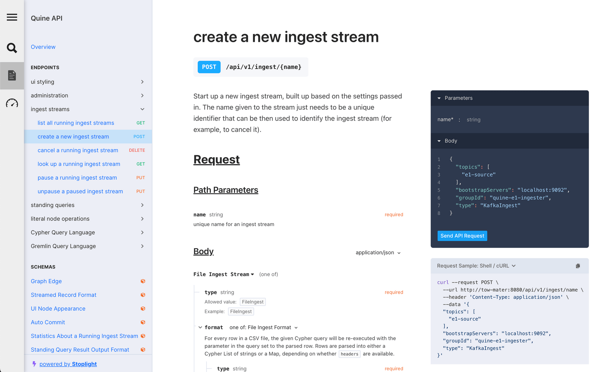

# REST API

The REST API documentation is served by the Quine web server at `/docs` and lists out all of the endpoints, how to call them, and some inline descriptions of what they do. The UI even makes it possible to interactively try out endpoints by filling in text fields and clicking buttons.

This entire page is powered by an OpenAPI specification of our API (the raw version which is accessible at `/docs/openapi.json`). This specification can also be used by users to generate client programs that call the API in the correct format, see @link:[this page](https://openapi-generator.tech/){ open=new } for more details.

This interactive documentation also includes a detailed specification of every API, describing all optional and required values, and showing what the possible options are.  In some of the API endpoints (like Standing Queries or Ingest Streams) these options can be very complicated and detailed, with many options available. All available options are shown in this "Schema" section.
