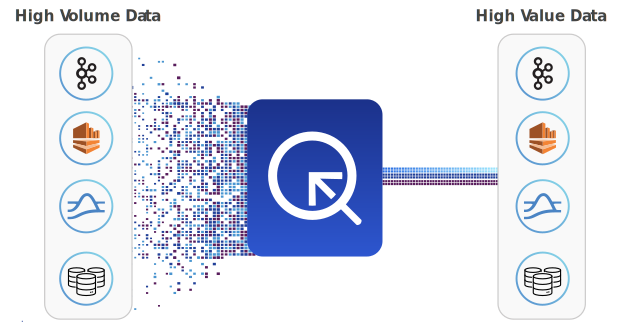

# Streaming Systems

A streaming system processes events — data — that is **continuously generated**, often in **high volumes** and at **high velocity** in real time. A streaming event source typically consists of a continuous stream of timestamped logs that record events as they happen – such as a user logging in via an identity management system, or a web server logging page requests from an online application.



Architecturally, Quine fits into a streaming event pipeline in between, or consuming from and writing back out to, streaming event processor like Kafka or Kinesis. Quine can shape, filter, analyze, or take action based on patterns matched in the event stream.

## Streaming vs Batch Processing

Event driven applications need to process events quickly, often within the time window of a single transaction. Quine allows you to analyze a stream of events in real time and match patterns, or sub-graphs of interest, using graph database techniques and, when it finds matches, to immediately execute a pre-defined action.

Historically, event analysis is done in batches, and by definition, batch processing does not provide real-time or near real-time results. A batch system analyses large groups of events well after the events occurred, typically with a goal to produce metrics, trends, or data for AI models. The insights discovered by batch processing detail "**what happened**" in an event stream but they are not capable of describing what "**is**" happening while it's happening.

Finding relationships between events with categorical data in real-time has significant implications for cyber security, fraud detection, observability, logistics, e-commerce, and really any use case graph is both well-suited for and must process high velocity data in real time.

Properties of a streaming system:

* Performs ETL in real-time
* Treats stream as infinite — no beginning or end
* Detects interesting patterns
* Engineered to process high volumes of data and, often, for fault tolerance

## Deployment Patterns

Quine is designed to be deployed within an event streaming data pipeline.

* A single Quine instance, properly configured, can handle an infinite stream of data. Quine is limited only by how many values are available in the QuineId type that you choose, and it's possible to choose unbounded types.

* Quine currently supports RocksDB (default), Cassandra, and MapDB for persisting ingested event data. Of course you need a storage plan with enough capacity to hold the amount of data your application needs. Cassandra allows for one Quine host and many Cassandra systems whereas RocksDB are MapDB persistors are available to use as local storage.

* Because data is effectively infinite, Quine takes a unique approach to indexing, using a custom consistent hash Cypher function (`idFrom`). Use an event value to generate a Node ID that you can use to create or locate a node in the graph. In Quine, accessing data is very fast IF you know the ID of the node in the graph that you want to query (or start a query from). The `idFrom` built-in function is a convenient convention for referring to nodes using values to deterministically calculate a `nodeId` in the the graph.

* Quine ingest is backpressured which makes it very stable in a high-volume event stream.

* Standing query output results are also delivered in a backpressured stream.

* Standing queries, a feature unique to Quine, are Cypher queries that **persist** in the graph. Standing queries monitor the stream for important patterns or sub-graphs, maintain partial matches over time intervals you define, and execute instructions (e.g. updating the graph or publishing to a Kafka topic) the instant a full match is made.

* Standing queries can be created and canceled on the fly while ingest is happening. When you create a new standing query with live data already in the system, you can control how it is applied (e.g. lazily vs. proactively).

Typical Quine deployments:

1. Consume events from a source (e.g. Kafka or Kinesis) to detect known patterns and take action.
2. Aggregate event streams from different source types and produce a new event stream.
3. Ingest from a source, transform the events (for example, parameter isolation, reduction, or enrichment) and produce a new version of the event.

## Apache Kafka

Apache Kafka is a distributed streaming platform that is used to build real-time streaming data pipelines and applications.

### Ingesting from a Kafka topic

Ingesting from a Kafka topic as an event source is done by configuring an `ingest stream` using the `KafkaIngest` type. Quine supports ingest of raw bytes, JSON data, or structured data serialized in a protocol buffer.

More information is contained in the *"[create a new ingest stream](https://docs.quine.io/reference/rest-api.html#/paths/api-v1-ingest-name/post)"* API documentation. Be sure to select **Kafka Ingest Stream** in the body section.

```json
{
  "ingestStreams": [
    {
      "type": "KafkaIngest",
      "topics": [
        "test-topic"
      ],
      "bootstrapServers": "localhost:9092",
      "format": {
        "type": "CypherJson",
        "query": "MATCH (n) WHERE id(n) = idFrom($that) SET n = $that"
      }
    }
  ]
}
```

### Output to a Kafka topic

When Quine as positioned upstream in a data pipeline as an event source for Kafka, Quine publishes a record for each `StandingQueryResult` to a topic configured in the `WriteToKafka` output. Records can be serialized as JSON or Protocol Buffers before being published to Kafka. See the [Standing Query Result Output](https://docs.quine.io/reference/rest-api.html#/schemas/StandingQueryResultOutput) API documentation for details. Be sure to select **Publish to Kafka Topic** in the doc.

```json
{
  "standingQueries": [
    {
      "pattern": {
        "type": "Cypher",
        "query": "MATCH (n) RETURN DISTINCT id(n) AS id",
        "mode": "DistinctId"
      },
      "outputs": {
        "toKafka": {
          "type": "WriteToKafka",
          "topic": "testToKafka",
          "bootstrapServers": "localhost:9092",
          "format": {
            "type": "JSON"
          }
        }
      }
    }
  ]
}
```

## Amazon Kinesis

Kinesis Data Stream is an Amazon Web Service designed to process large-scale data streams from a multitude of services in real time.

### Ingesting from a Kinesis topic

Ingesting from a Kinesis Data Stream as an event source is done by configuration an `ingest stream` using the `KinesisIngest` type. Quine supports ingest of raw bytes, JSON data, or structured data serialized in a protocol buffer.

More information is contained in the *"[create a new ingest stream](https://docs.quine.io/reference/rest-api.html#/paths/api-v1-ingest-name/post)"* API documentation. Be sure to select **Kinesis Ingest Stream** in the body section.

```json
{
  "ingestStreams": [
    {
      "type": "KinesisIngest",
      "streamName": "stream-feed",
      "credentials": {
        "region": "your_aws_region",
        "accessKeyId": "your_access_key_id",
        "secretAccessKey": "your_secret"
      },
      "format": {
        "type": "CypherProtobuf",
        "schemaUrl": "event-view.desc",
        "typeName": "EventView",
        "query": "CREATE ($that)"
      }
    }
  ]
}
```

### Output to a Kinesis topic

Quine publishes a record for each `StandingQueryResult` to a stream configured in the `WriteToKinesis` output. Records can be serialized as JSON or Protocol Buffers before being published to Kafka. See the [Standing Query Result Output](https://docs.quine.io/reference/rest-api.html#/schemas/StandingQueryResultOutput) API documentation for details. Be sure to select **Publish to Kinesis Stream** in the doc.

```json
{
  "standingQueries": [
    {
      "pattern": {
        "type": "Cypher",
        "query": "MATCH (n) RETURN DISTINCT id(n) AS id",
        "mode": "DistinctId"
      },
      "outputs": {
        "toKinesis": {
          "type": "WriteToKinesis",
          "streamName": "quine-output",
          "credentials": {
            "region": "your_aws_region",
            "accessKeyId": "your_access_key_id",
            "secretAccessKey": "your_secret"
          },
          "format": {
            "type": "Protobuf",
            "schemaUrl": "event-view.desc",
            "typeName": "EventView"
          },
          "query": "MATCH (n) WHERE id(n) = $that.data.id RETURN n.timestamp, n"
        }
      }
    }
  ]
}
```
