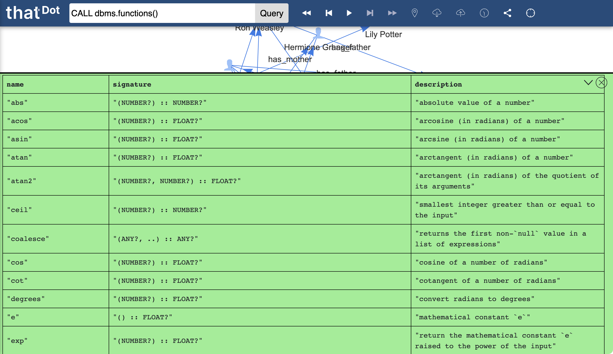

# Exploration UI

Quine's Exploration UI is an interactive canvas for exploring specific sub-graphs of data. While Quine overall is a streaming graph interpreter, the Exploration UI gives a user the ability to explore subsets of data in a style more similar to a database. This tool is particularly useful for investigating specific data found via the streaming capabilities built into the rest of the system. It facilitates an ad hoc, interactive exploration of small subsets of data.

@@@ note
The Exploration UI is fully supported in Chrome. Other browsers are likely to work for most cases, but may experience some unusual behavior. In particular, Safari occassionaly does not update or garbles text values returned in the interactive documentation. Safari also renders nodes more slowly than Chrome, so animating the layout of many nodes is likely to be slow in Safari.
@@@

## Components

The Exploration UI is composed of a toolbar along the top and a main canvas in white taking of most of the page. Data represented as nodes and edges will be rendered on the canvas in response to queries issued in the toolbar. A navigation bar along the left side will take you away from the Exploration UI to other views of the system.

### Toolbar

- **Query Bar**: Type in a query here to render data into the canvas. A drop-down arrow appears here if starting queries are defined.
- **Previous Checkpoint**: Click to restore the canvas contents to the previous saved checkpoint.
- **Undo**: Click to undo the last action on the canvas.
- **Animate**: Click to animate the layout of nodes in the canvas. Click again to stop animation.
- **Redo**: Click to redo the the canvas action which was previously undone.
- **Next Checkpoint**: Click to jump to the next checkpoint.
- **Checkpoint**: Click to save the current canvas contents as a checkpoint. Right-click to list all available checkpoints and jump to a chosen checkpoint.
- **Download**: Click to download the current canvas (and canvas history) as a JSON object.
- **Upload**: Click to choose a JSON file to upload and restore its state (and canvas history) to the canvas.
- **Historical Query**: Click to set a historical moment to query the underlying data as it was at that moment. This will set all queries issued in the Exploration UI to query only that historical moment.
- **Tree or Graph**: Click to choose between rendering the nodes in the canvas in a free-form graph, or a hierarchical tree. Note: tree organization is not customizable.
- **Recenter**: Click to return the canvas viewport to the center position.
- **Node Count**: An indicator to show how many nodes were returned in the last query.
- **Edge Count**: An indicator to show how many edges were returned in the last query.

### Canvas

Query results are rendered onto the shared space of the canvas. New results are added to what is already rendered on the canvas so far. Edges between all rendered nodes are automatically added to the canvas. Rendered nodes may also have additional edges, but they will be shown in the canvas only if the node at the other end of the edge is also rendered.

Nodes often contain properties, which can be viewed by hovering the mouse over particular nodes. The popup box shown on hover also displays associated metadata like the node's ID. Queries in progress that have not yet returned results cause a spinner to display in the upper-right corner of the canvas. Nodes rendered in the UI represent the data on each node -at the time it was returned-. Updating the state of a node is accomplished by returning that node again (or using the "Refresh" quick query).

----------------------

When new results are returned to the canvas, the canvas animates briefly to layout all results. Nodes can be selected and moved around the canvas, or pinned so that they do not move when the canvas is animated. Additional, contextually relevant queries can be easily initiated by right-clicking a node and choosing the appropriate query.

----------------------

When a query is issued that is not expected to return nodes, a text area with green background appears at the bottom of the canvas to show the results. Error messages are also returned in this text area, with a pale red background. Textual results can be dismissed with the "X" in the corner of the text area.

----------------------

Node appearances, contextual queries, and default starting queries in the query bar can be customized by using the corresponding @ref:[API calls documented](../reference/rest-api.md) under the heading of "UI Styling".

## How to Use the Exploration UI

### Running Queries

Queries are issued in one of three ways:

1. Typed into the Query Bar and executed by pressing Enter or clicking the "Query" button.
2. Chosen from the "Quick Query" context menu found by right-clicking a node (when defined). Note that this actually adds the query to the query bar and executes it.
3. Executed on page load when the URL for the Exploration UI ends with a hash (`#`) followed by a query.

@@@ warning

The Exploration UI in Quine can make it feel like a database, but it is a streaming graph interpreter meant for working with infinite streams of data. Quine is run without indices by default. If Quine is managing a large amount of data, some queries which require scanning all nodes can take a very long time and slow down other functionality. It is strongly recommended to use a node ID in each query or use built in functions like `idFrom(…)` or `recentNodes()` to efficiently pull out small amounts of data. @ref:[See this page for more guidance on querying infinite data](../core-concepts/querying-infinite-data.md).

@@@

Queries are written in either @ref:[Cypher](../reference/cypher/cypher-language.md) or @ref:[Gremlin](../reference/gremlin-language.md). While virtually all of the Cypher syntax is available, Gremlin support is limited to only a subset of the language. The Gremlin language embeds other languages (like Groovy) inside of it, and is therefore not suitable in its entirety for use in Quine. Either language can be entered into the query bar and the system will detect it automatically.

The Exploration UI can be configured with any set of queries pre-programmed and available via a drop-down menu from the query bar. These starting queries can be configured through the REST API. Starting queries can be parameterized with easily completed values to make pulling out complex patterns very easy when the proper starting value is identified.

By default, queries issued in the Exploration UI are expected to return nodes (and only nodes). Nodes returned from queries will be rendered in the canvas. After computing the nodes returned from a query, the Exploration UI automatically resolves the edges to display in the canvas. Edges which connect nodes rendered in the canvas (previously rendered nodes and newly returned node results) will all be displayed.

One query is -issued- at a time, but any number of queries can be executing simultaneously. As new queries are issued, the in-progress spinner on the right reports the number of currently executing queries. Hovering the mouse over the spinner/counter will turn it into an "X" which can be clicked to cancel all in-progress queries. Since some queries can can continue forever (e.g. wiretapping a Standing Query), clicking the "X" that appears in the progress spinner is the only way to gracefully end the query.

In addition to node-centric queries, queries can return textual or tabular results. These results are not rendered on the canvas directly but into a text area that appears at the bottom of the canvas. By default, all queries entered into the query bar are expected to return nodes or an error will be thrown. To deliberately run a query that is expected to return text, hold the Shift key while executing the query. Query and system errors are also reported in the text area. Results can continue to stream through the text area in perpetuity, so the right side also includes a button to scroll to the very top or bottom of the results. The text area can be resized by dragging its top border, or closed manually by the clicking the "X".

Quine includes many utility functions built in, and the ability to add in custom user-defined queries. To list all available functions which can be included in queries, you can execute the text query `CALL dbms.functions()` or `CALL dbms.procedures()` to print out the name, signature, and documentation for all currently supported functions and procedures.

### Interacting With Data

A quick query is a pre-programmed query that is made available for execution by right-clicking a relevant starting node. Any number of quick queries can be pre-programmed into the system, and each quick query can define on which kind of node it becomes available. The node on which the quick query is executed is provided as input into the query. 

Quick queries that are configured with an `edgeLabel` will produce a "synthetic edge" in the Exploration UI. A synthetic edge is rendered as a purple dotted edge in the Exploration UI. A synthetic edge does not directly exist in the underlying data; it exists only in the canvas. A synthetic edge connects the starting node from a quick query with all the results returned from that quick query. Synthetic edges enable displaying a complex result (e.g. the result of a complex graph traversal) as a simple single edge.

Nodes rendered on the canvas represent the state of the node at the moment it was retrieved by Quine. To update the rendered node on the canvas with new properties, the node simply needs to be returned again. This is done with another query, or by right-clicking a node and choosing the built-in Quick Query to "Refresh" a node. If multiple nodes are selected (e.g. by pressing Ctrl-A, or holding shift to draw a box or multi-select), clicking the "Refresh" quick query for one will refresh all selected nodes.

When queries are executed and new results are added to the canvas, nodes are animated by simulating the physics of a force-directed graph. This animation helps to lay out nodes in a two-dimensional arrangement for quick interpretation and further interaction. Depending on the data, the short animation may not be enough to conveniently separate the rendered nodes. In that case, clicking the play button will allow the physics animation to continue indefinitely until the animation is paused again. Individual nodes (or groups of nodes) can be "pinned" to the canvas and removed from the physics simulation by holding the Shift key and clicking and holding on a node until it flashes black. Nodes that have been removed from the physics simulation will have a subtle drop shadow behind their node and label. To unpin a node and allow it to animate freely again, repeat the process of holding Shift and clicking and holding on the node(s).

### Using the toolbar buttons

Interactive exploration of the data is usually an iterative process. Investigating one node often leads to the next, which leads to the next, and so on. As such, interactive exploration benefits from the ability to jump back and forth between what has been rendered at each step, as well as saving and sharing of progress. The toolbar includes buttons to undo and redo each step of the exploration. Each time results are rendered to the canvas, a new entry is added to the timeline managed by the Exploration UI.

At any point during exploration, clicking the checkpoint button will allow the user to create a named checkpoint in the exploration. Right-clicking the checkpoint button will show a list of all named checkpoints and where they fall in the timeline compared to the present state of the canvas.

Clicking the download button will download a JSON representation of the exploration history so far. The `history.json` file can be loaded back into the Exploration UI using the upload button on any machine running Quine, whether it is a part of the original system or not.

The Exploration UI is an interface into the underlying graph data managed by Quine. The underlying graph data is fully versioned, making it possible to run queries at past moments to see what the results would have been at previous points in time. Unlike the timeline used to undo and redo exploration history, historical queries are a feature of the underlying graph interpreter, and not the Exploration UI. The Exploration UI does provide an interface to querying past historical moments, however. A user can set the Exploration UI to query past moments by clicking the History button and following the prompt to choose a single historical moment to begin a new exploration session. Choosing a new historical moment to query with the history button will clear anything rendered on the canvas and in the Exploration UI timeline.

Querying for a matched node is especially useful if there is a Cypher query registered as one of the outputs of the Standing Query and if that second query modifies the data—for instance, adding an edge connected to the node.

## Reference: Key Combinations

- **Enter**: when in the query bar, equivalent to clicking the "Query" button.
- **Shift-Enter**: when in the query bar, execute a text query; equivalent to Shift-clicking the "Query" button.
- **Ctrl-A**: select all nodes on the canvas.
- **Backspace**: remove the selected node(s) from the canvas.
- **Shift-click and drag**: draw a box to select multiple nodes.
- **Shift-click a node**: add a node to the selected nodes.
- **Right click a node**: bring up the menu of quick queries available from the clicked node.
- **Shift-click and hold a node**: pin it to the canvas so it does not animate with future queries.
- **Double click a node**: execute the node's default quick query (the first in the node's quick query list).
- **Shift-click the download button**: Download only the current state (not the full undo/redo timeline or checkpoints).
- **Shift-click thatDot logo**: download an SVG image of the canvas.
