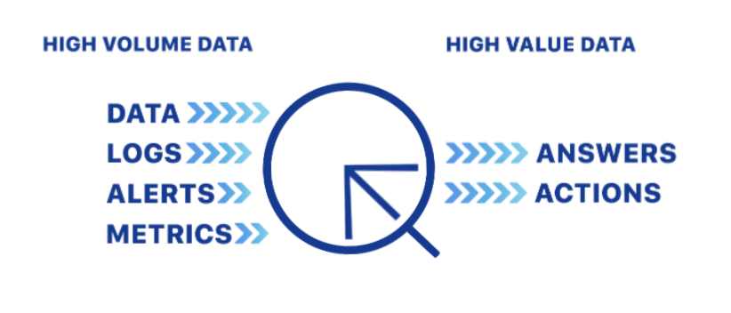
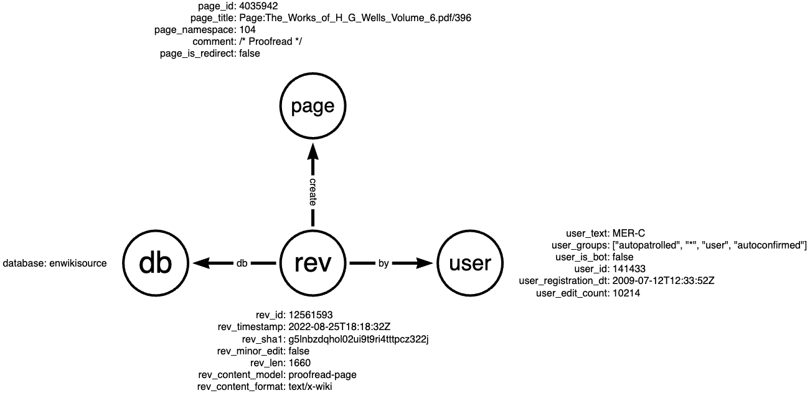

# Ingest Streams

Quine is specifically designed to ingest and process high volumes of event data from one or more streams, turning events into a graph to make it easy to detect complex patterns, and streaming the results out in real-time. There are two main structures that you need to properly use Quine: the @link:[**ingest stream**](https://docs.quine.io/reference/rest-api.html#/schemas/com.thatdot.quine.routes.IngestStreamConfiguration) { open=new } and the @link:[**standing query**](https://docs.quine.io/reference/rest-api.html#/schemas/com.thatdot.quine.routes.StandingQueryDefinition) { open=new }. In this tutorial we will cover the ingest stream.



The ingest stream is where a streaming graph starts. It connects to data producers, transforms the data, then populates a streaming graph to be analyzed by standing queries.

Let's take a look at how ingest streams work.

Quine is fundamentally a stream-oriented data processor that uses a graph data model. This provides optimal integration with streaming data producers and consumers such as Kafka and Kinesis. Quine can also process batch data, consuming data from CSV files, databases and data lakes, or web APIs.

## Our Scenario

For the sake of this tutorial, assume that you need to separate human-generated events from bot-generated events in the english wikipedia database and send them to a destination in your data pipeline for additional processing. We will discuss concepts and provide code examples with this use case in mind.

## Ingest Stream Concepts

**What is an Ingest Stream?**

An *ingest stream* connects a data source to Quine and prepares the emitted data for the streaming graph. Within the ingest stream, an ingest query written in Cypher, updates the streaming graph nodes and edges as data is received.

**Quine Node IDs**

With a graph data model, nodes are the primary unit of data — much like a "row" is the primary unit of data in a relational database. However, unlike traditional graph data systems, a Quine user never has to create a node directly. Instead, using `idFrom`, *the graph functions as if all nodes exist.*

Quine represents every possible node as an existing "empty node" with no history. As data streams into the system, previously empty nodes accumulate properties and connections to other nodes (edges). As new data arrives and nodes are updated, Quine keeps track of each node's history.

**Locating any node using `idFrom`**

`idFrom` is a Cypher function specific to Quine and allows you to retrieve node data without an index. `idFrom` takes any number of arguments and deterministically produces a node ID (hash) from that input. You will use `idFrom` in the ingest query portion of every ingest stream that you create.

For example, the absolute minimum ingest query to load any incoming data into the graph is simply a wrapper around the `idFrom` function.

```cypher
MATCH (n) WHERE id(n) = idFrom($that) SET n.line = $that
```

This query creates nodes but does not create any edges, so this is not a very interesting or useful graph. It does however demonstrate the basic mechanism for `idFrom`.

## Syntax and Structure

The first step when defining an ingest stream is to understand the patterns you are trying to find, or put another way, the questions you want the data to answer. This will determine the overall shape of your graph -- which fields are nodes, which are properties of nodes, and how all of these connect.

This is no different than designing a SQL database except that Quine's graph data structure conforms to the familiar *subject-predicate-object* structure found in most human languages. Properly structuring your Quine graph is an important step in making standing queries and quick queries productive and performant.

An ingest query is defined by setting a `type` as described by the @link:[API documentation](https://docs.quine.io/reference/rest-api.html#/paths/api-v1-ingest-name/post) { open=new }. Quine supports many types of ingest streams. Each type has a unique form and requires a specific structure to configure properly.

For example, we can use a "server sent events" ingest stream to connect the live stream of page revisions on Wikipedia; @link:[mediawiki.revision-create](https://stream.wikimedia.org/?doc#/streams/get_v2_stream_mediawiki_revision_create) { open=new }.

Issue the following `curl` command in a terminal running on the machine were you started Quine.

```shell
curl -X "POST" "http://127.0.0.1:8080/api/v1/ingest/wikipedia-revision-create" \
     -H 'Content-Type: application/json' \
     -d $'{
  "format": {
    "query": "CREATE ($that)",
    "parameter": "that",
    "type": "CypherJson"
  },
  "type": "ServerSentEventsIngest",
  "url": "https://stream.wikimedia.org/v2/stream/mediawiki.revision-create"
}'
```

Take note of the structure of the ingest stream object carried in the body of the POST.

```json
{
  "format": {
    "query": "CREATE ($that)",
    "parameter": "that",
    "type": "CypherJson"
  },
  "type": "ServerSentEventsIngest",
  "url": "https://stream.wikimedia.org/v2/stream/mediawiki.revision-create"
}
```

* **type** - identifies the type of ingest stream to create. In this case we created a "server sent events" ingest stream
* **url** - sets the URL for the event producer
* **format** - specifies the ingest query for the ingest stream (we will cover this in detail shortly)

This ingest stream will load the stream of `revision-create` events from `mediawiki` into your graph. Without defining any relationships between node types, the nodes are all disconnected. Let's pause this ingest stream and consider how to create a graph from the events.

Send a PUT to the `/api/v1/ingest/{stream-name}/pause` endpoint to stop ingesting events.

```shell
curl -X "PUT" "http://127.0.0.1:8080/api/v1/ingest/wikipedia-revision-create/pause"
```

## The shape of your data

Before going too far with this example, we need to step back and understand the shape of the event data that we receive from the `revision-create` event stream. Although Quine does not require a pre-defined schema, understanding the shape of the data you are working with is tremendously helpful when writing Cypher queries.

Wikimedia defines a schema for the `revision-create` event in @link:[API documentation](https://stream.wikimedia.org/?doc#/streams/get_v2_stream_mediawiki_page_create) { open=new }.  The documentation at the time of writing this tutorial uses SwaggerUI to interpret their @link:[openapi](https://swagger.io/specification/) { open=new } specification file which makes it easy for us to understand the API.  

Here is the sample `revision-create` event schema from the documentation:

```json
{
  "$schema": "/mediawiki/revision/create/1.2.0",
  "database": "examplewiki",
  "meta": {
    "domain": "test.wikipedia.org",
    "dt": "2020-06-10T18:57:16Z",
    "stream": "mediawiki.revision-create",
    "uri": "https://examplewiki.wikipedia.org/wiki/TestPage10"
  },
  "page_id": 123,
  "page_is_redirect": false,
  "page_namespace": 0,
  "page_title": "TestPage10",
  "performer": {
    "user_edit_count": 1,
    "user_groups": [
      "*",
      "user",
      "autoconfirmed"
    ],
    "user_id": 123,
    "user_is_bot": false,
    "user_registration_dt": "2016-01-29T21:13:24Z",
    "user_text": "example_user_text"
  },
  "rev_content_changed": true,
  "rev_content_format": "text/x-wiki",
  "rev_content_model": "wikitext",
  "rev_id": 123,
  "rev_is_revert": false,
  "rev_len": 3,
  "rev_minor_edit": false,
  "rev_parent_id": 122,
  "rev_sha1": "mr0szy90m5qbn6tek7ch3nebaild3tm",
  "rev_slots": {
    "main": {
      "rev_slot_content_model": "wikitext",
      "rev_slot_origin_rev_id": 123,
      "rev_slot_sha1": "2mx9qnkore72az8niqap1s3ycpu1jej",
      "rev_slot_size": 20
    }
  },
  "rev_timestamp": "2020-06-10T18:57:16Z"
}
```

By inspecting the sample `revision-create` object from the documentation, we identify several groups of parameters that will make for interesting graph analysis later.

* Information about the page
* Which database the page belongs to
* The user creating the page
* Information about the revision that was submitted

Using the information that we identified above, we can create a model of the graph from the `revision-create` event.



## Define an ingest stream

Using this model from above we can create an ingest query in Cypher to shape and load the event into nodes in the graph.

```cypher
MATCH (revNode),(pageNode),(dbNode),(userNode),(parentNode)
WHERE id(revNode) = idFrom('revision', $that.rev_id) 
  AND id(pageNode) = idFrom('page', $that.page_id) 
  AND id(dbNode) = idFrom('db', $that.database)
  AND id(userNode) = idFrom('id', $that.performer.user_id) 
  AND id(parentNode) = idFrom('revision', $that.rev_parent_id)

SET revNode = $that,
    revNode.bot = $that.performer.user_is_bot,
    revNode:revision

SET parentNode.rev_id = $that.rev_parent_id

SET pageNode.id = $that.page_id, 
    pageNode.namespace = $that.page_namespace, 
    pageNode.title = $that.page_title, 
    pageNode.comment = $that.comment, 
    pageNode.is_redirect = $that.page_is_redirect, 
    pageNode:page 

SET dbNode.database = $that.database, 
    dbNode:db 

SET userNode = $that.performer, 
    userNode.name = $that.performer.user_text, 
    userNode:user 

CREATE (revNode)-[:TO]->(pageNode),
       (pageNode)-[:IN]->(dbNode),
       (userNode)-[:RESPONSIBLE_FOR]->(revNode),
       (parentNode)-[:NEXT]->(revNode)
```

Take a minute to understand this Cypher query.

The first thing that Quine does when it receives an event from an event source is to parse the object based on the ingest stream `type` setting and pass along the parsed object in the `$that` parameter.

The first `MATCH` statement locates the `revNode`, `pageNode`, `dbNode`, `userNode` and `parentNode` nodes by setting the node id to the id determined by the `idFrom` function.

```cypher
MATCH (revNode),(pageNode),(dbNode),(userNode),(parentNode)
WHERE id(revNode) = idFrom('revision', $that.rev_id) 
  AND id(pageNode) = idFrom('page', $that.page_id) 
  AND id(dbNode) = idFrom('db', $that.database)
  AND id(userNode) = idFrom('id', $that.performer.user_id) 
  AND id(parentNode) = idFrom('revision', $that.rev_parent_id)
```

The next section of the query uses `SET` to populate the properties into each node from the parsed data in `$that`.

```cypher
SET revNode = $that,
    revNode.bot = $that.performer.user_is_bot,
    revNode:revision

SET parentNode.rev_id = $that.rev_parent_id

SET pageNode.id = $that.page_id, 
    pageNode.namespace = $that.page_namespace, 
    pageNode.title = $that.page_title, 
    pageNode.comment = $that.comment, 
    pageNode.is_redirect = $that.page_is_redirect, 
    pageNode:page 

SET dbNode.database = $that.database, 
    dbNode:db 

SET userNode = $that.performer, 
    userNode.name = $that.performer.user_text, 
    userNode:user
```

And the final section of the query establishes the relationships between the nodes using `CREATE`.

```cypher
CREATE (revNode)-[:TO]->(pageNode),
       (pageNode)-[:IN]->(dbNode),
       (userNode)-[:RESPONSIBLE_FOR]->(revNode),
       (parentNode)-[:NEXT]->(revNode)
```

Now, lets update the `wikimedia-revision-create` ingest stream with this new ingest query.

* Remove the existing ingest stream.

```shell
curl -X "DELETE" "http://127.0.0.1:8080/api/v1/ingest/wikipedia-revision-create"
```

* Create a new ingest stream configuration JSON object.

```json
{
  "format": {
    "query": "MATCH (revNode),(pageNode),(dbNode),(userNode),(parentNode) WHERE id(revNode) = idFrom('revision', $that.rev_id) AND id(pageNode) = idFrom('page', $that.page_id) AND id(dbNode) = idFrom('db', $that.database) AND id(userNode) = idFrom('id', $that.performer.user_id) AND id(parentNode) = idFrom('revision', $that.rev_parent_id) SET revNode = $that, revNode.bot = $that.performer.user_is_bot, revNode:revision SET parentNode.rev_id = $that.rev_parent_id SET pageNode.id = $that.page_id, pageNode.namespace = $that.page_namespace, pageNode.title = $that.page_title, pageNode.comment = $that.comment, pageNode.is_redirect = $that.page_is_redirect, pageNode:page SET dbNode.database = $that.database, dbNode:db SET userNode = $that.performer, userNode.name = $that.performer.user_text, userNode:user CREATE (revNode)-[:TO]->(pageNode), (pageNode)-[:IN]->(dbNode), (userNode)-[:RESPONSIBLE_FOR]->(revNode), (parentNode)-[:NEXT]->(revNode)",
    "parameter": "that",
    "type": "CypherJson"
  },
  "type": "ServerSentEventsIngest",
  "url": "https://stream.wikimedia.org/v2/stream/mediawiki.revision-create"
}
```

* POST the ingest stream JSON to `/api/v1/{ingest-stream-name}`

```shell
curl -X "POST" "http://127.0.0.1:8080/api/v1/ingest/wikipedia-revision-create" \
     -H 'Content-Type: application/json' \
     -d $'{
  "type": "ServerSentEventsIngest",
  "format": {
    "query": "MATCH (revNode),(pageNode),(dbNode),(userNode),(parentNode) WHERE id(revNode) = idFrom(\'revision\', $that.rev_id) AND id(pageNode) = idFrom(\'page\', $that.page_id) AND id(dbNode) = idFrom(\'db\', $that.database) AND id(userNode) = idFrom(\'id\', $that.performer.user_id) AND id(parentNode) = idFrom(\'revision\', $that.rev_parent_id) SET revNode = $that, revNode.bot = $that.performer.user_is_bot, revNode:revision SET parentNode.rev_id = $that.rev_parent_id SET pageNode.id = $that.page_id, pageNode.namespace = $that.page_namespace, pageNode.title = $that.page_title, pageNode.comment = $that.comment, pageNode.is_redirect = $that.page_is_redirect, pageNode:page SET dbNode.database = $that.database, dbNode:db SET userNode = $that.performer, userNode.name = $that.performer.user_text, userNode:user CREATE (revNode)-[:TO]->(pageNode), (pageNode)-[:IN]->(dbNode), (userNode)-[:RESPONSIBLE_FOR]->(revNode), (parentNode)-[:NEXT]->(revNode)",
    "type": "CypherJson",
    "parameter": "that"
  },
  "url": "https://stream.wikimedia.org/v2/stream/mediawiki.revision-create"
}'
```

You can verify that the stream is active by sending `GET` to the `/api/v1/ingest` endpoint.

```shell
curl "http://127.0.0.1:8080/api/v1/ingest" | jq '.'
```

Quine will return the status of all of the ingest streams that are configured. In our case, we only have one stream and it is running.

```json
{
  "wikipedia-revision-create": {
    "status": "Running",
    "settings": {
      "format": {
        "query": "MATCH (revNode),(pageNode),(dbNode),(userNode),(parentNode) WHERE id(revNode) = idFrom('revision', $that.rev_id) AND id(pageNode) = idFrom('page', $that.page_id) AND id(dbNode) = idFrom('db', $that.database) AND id(userNode) = idFrom('id', $that.performer.user_id) AND id(parentNode) = idFrom('revision', $that.rev_parent_id) SET revNode = $that, revNode.bot = $that.performer.user_is_bot, revNode:revision SET parentNode.rev_id = $that.rev_parent_id SET pageNode.id = $that.page_id, pageNode.namespace = $that.page_namespace, pageNode.title = $that.page_title, pageNode.comment = $that.comment, pageNode.is_redirect = $that.page_is_redirect, pageNode:page SET dbNode.database = $that.database, dbNode:db SET userNode = $that.performer, userNode.name = $that.performer.user_text, userNode:user CREATE (revNode)-[:TO]->(pageNode), (revNode)-[:IN]->(dbNode), (userNode)-[:RESPONSIBLE_FOR]->(revNode), (parentNode)-[:NEXT]->(revNode)",
        "parameter": "that",
        "type": "CypherJson"
      },
      "url": "https://stream.wikimedia.org/v2/stream/mediawiki.revision-create",
      "parallelism": 16,
      "type": "ServerSentEventsIngest"
    },
    "stats": {
      "ingestedCount": 1666,
      "rates": {
        "count": 1666,
        "oneMinute": 21.44527113707015,
        "fiveMinute": 15.367459925922011,
        "fifteenMinute": 13.715948876513574,
        "overall": 26.105181113725962
      },
      "byteRates": {
        "count": 2574561,
        "oneMinute": 32566.461096455438,
        "fiveMinute": 22733.450385686425,
        "fifteenMinute": 20032.299030301117,
        "overall": 40341.915896294115
      },
      "startTime": "2022-09-28T15:13:21.932384Z",
      "totalRuntime": 62921
    }
  }
}
```

## Next Steps

You have data streaming into Quine and forming a graph. Over time, the shape of the graph will become more connected as new events arrive.

In the @ref:[standing query](standing-queries-tutorial.md) tutorial we will separate human generated events from bot generated events in the english wikipedia database and send them to a destination in your data pipeline for additional processing.  
