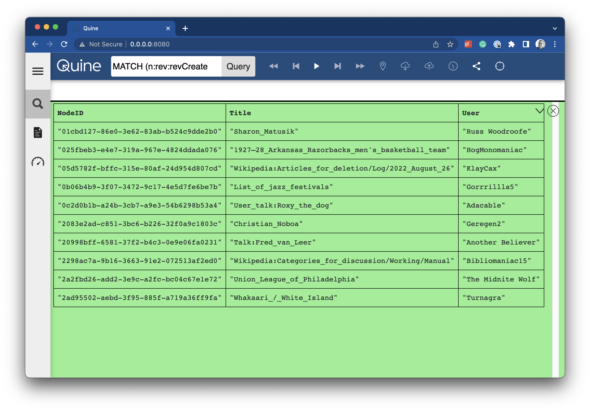

# Standing Queries

A standing query is a feature unique to Quine. Standing queries monitor streams for specified patterns, maintaining partial matches, and executing user-specified actions the instant a full match is made. Actions can include anything from updating the graph itself by creating new nodes or edges, writing results out to Kafka or Kinesis, or posting results to a webhook. Whatever fits your streaming data pipeline.

Standing queries are a unique (and we think powerful) feature of Quine. Standing queries are key to how Quine can achieve sub-millisecond performance finding complex patterns (or subgraphs) in high volume event streams. Standing queries are also a key reason why Quine does not impose time windows, setting it apart from other event processing systems.

## Format of a standing query

A standing query is defined in two parts: a **pattern** and an **output**. The **pattern** defines what we want to match, expressed in Cypher using the form `MATCH … WHERE … RETURN …`. The **output** defines the action(s) to take for each result produced by the `RETURN`  in the pattern query.

In general, a standing query definition JSON object takes form as in this example.

```json
{
  "pattern": {
    "query": "MATCH (n)-[:has_father]->(m) WHERE exists(n.name) AND exists(m.name) RETURN DISTINCT strId(n) AS kidWithDad",
    "type": "Cypher"
  },
  "outputs": {
    "file-of-results": {
      "path": "kidsWithDads.jsonl",
      "type": "WriteToFile"
    }
  }
}
```

A StandingQueryResult is an object with 2 sub-objects: `meta` and `data`. The `meta` object consists of:

* UUID `resultId`
* boolean `isPositiveMatch`

When the `pattern` query makes a positive match, the `data` object consists of the data returned by the Standing Query.

For example, a StandingQueryResult may look like the following:

```json
{
    "meta": {
        "resultId": "b3c35fa4-2515-442c-8a6a-35a3cb0caf6b",
        "isPositiveMatch": true
    },
    "data": {
        "kidWithDad": "a0f93a88-ecc8-4bd5-b9ba-faa6e9c5f95d"
    }
}
```

There are many standing query result output types. The @link:[API documentation](https://docs.quine.io/reference/rest-api.html#/schemas/StandingQueryResultOutput) { open=new } defines the format for each output type.  

* `CypherQuery`
* `Drop`
* `POST to HTTP(S) Webhook`
* `Publish to Slack Webhook`
* `Log JSON to Console`
* `Log JSON to File`
* `Publish to Kafka topic`
* `Publish to Kinesis Stream`
* `Publish to SNS topic`

Outputs can chain together using `andThen` to allow a single pattern query match to produce multiple outputs.

## Writing a standing query

Remember the scenario that we developed in the @ref:[ingest stream](ingest-streams-tutorial.md) tutorial:

>For the sake of this tutorial, assume that you need to separate human-generated events from bot-generated events in the English Wikipedia database and send them to a destination in your data pipeline for additional processing.

Our ingest stream is processing events as they arrive from the `mediawiki.revision-create` event source and manifesting them as nodes in the graph.

Our task is to find the human-generated events (not bots) in the stream, separate them from the rest of the stream and send them to another service for processing.

1. Write a Cypher query to match our scenario.

Using the Exploration UI we can develop a Cypher query that returns the last 10 `revision-create` event nodes.

```cypher
MATCH (n:rev:revCreate)
WHERE n.performer.user_is_bot = false
  AND n.database = "enwiki"
RETURN DISTINCT strid(n) as NodeID,
  n.page_title as Title,
  n.performer.user_text as User
LIMIT 10
```



We can use this Cypher query to develop the standing query.

1. Write the `pattern`  portion of the standing query

```cypher
MATCH (n:rev:revCreate) WHERE n.performer.user_is_bot = false AND n.database = 'enwiki' RETURN id(n) as id
```

2. Write the `output` portion of the standing query

```cypher
MATCH (n) WHERE id(n) = $that.data.id RETURN properties(n)
```

3. Form the standing query JSON object

```json
{
  "pattern": {
    "query": "MATCH (n:rev:revCreate) WHERE n.performer.user_is_bot = false AND n.database = 'enwiki' RETURN id(n) as id",
    "type": "Cypher",
    "mode": "MultipleValues"
  },
  "outputs": {
    "print-output": {
      "type": "CypherQuery",
        "query": "MATCH (n) WHERE id(n) = $that.data.id RETURN properties(n)",
        "andThen": {
          "type": "PrintToStandardOut"
        }
    }
  }
}
```

For simplicity, I am sending the output from the standing query to the console. You could easily send the output to another server via a webhook.

4. POST the standing query via `curl` into Quine for processing.

```shell
curl -X "POST" "http://127.0.0.1:8080/api/v1/query/standing/not-a-bot" \
     -H 'Content-Type: application/json' \
     -d $'{
  "pattern": {
    "query": "MATCH (n:rev:revCreate) WHERE n.performer.user_is_bot = false AND n.database = \'enwiki\' RETURN id(n) as id",
    "type": "Cypher",
    "mode": "MultipleValues"
  },
  "outputs": {
    "print-output": {
      "type": "CypherQuery",
      "query": "MATCH (n) WHERE id(n) = $that.data.id RETURN properties(n)",
      "andThen": {
        "type": "PrintToStandardOut"
      }
    }
  }
}'
```

Almost immediately you should see "non-bot" generated events appear in the terminal window similar to the one below.

```shell
2022-08-26 16:21:37,835 Standing query `print-output` match: {"meta":{"isPositiveMatch":true,"resultId":"bb9249d7-5102-4104-afce-c07a3d237546"},"data":{"properties(n)":{"$schema":"/mediawiki/revision/create/1.1.0","comment":"clean up","database":"enwiki","meta":{"domain":"en.wikipedia.org","dt":"2022-08-26T21:21:36Z","id":"7836bfc6-7372-4b6a-bd65-a3ed0a62f5de","offset":2838029929,"partition":0,"request_id":"b102aaf2-cd98-4829-a8fd-741663104215","stream":"mediawiki.revision-create","topic":"eqiad.mediawiki.revision-create","uri":"https://en.wikipedia.org/wiki/Luke_Harris"},"page_id":71585932,"page_is_redirect":false,"page_namespace":0,"page_title":"Luke_Harris","parsedcomment":"clean up","performer":{"user_edit_count":275949,"user_groups":["extendedconfirmed","*","user","autoconfirmed"],"user_id":14841472,"user_is_bot":false,"user_registration_dt":"2011-06-26T21:29:06Z","user_text":"Joeykai"},"rev_content_changed":true,"rev_content_format":"text/x-wiki","rev_content_model":"wikitext","rev_id":1106862807,"rev_len":3832,"rev_minor_edit":true,"rev_parent_id":1106729293,"rev_sha1":"ltx1i9nlezpw1wvak4mueahi6v3f155","rev_slots":{"main":{"rev_slot_content_model":"wikitext","rev_slot_origin_rev_id":1106862807,"rev_slot_sha1":"ltx1i9nlezpw1wvak4mueahi6v3f155","rev_slot_size":3832}},"rev_timestamp":"2022-08-26T21:21:36Z"}}}
```

## Next Steps

Congratulations! You have a stream of non-bot generated `revision-create` events isolated from the main event stream and you are displaying them in your terminal.

Up to this point, we've been using the REST API to interact with Quine. In the next section, we will collect all of the API calls that we've made and build a @ref:[recipe](recipes-tutorial.md).
