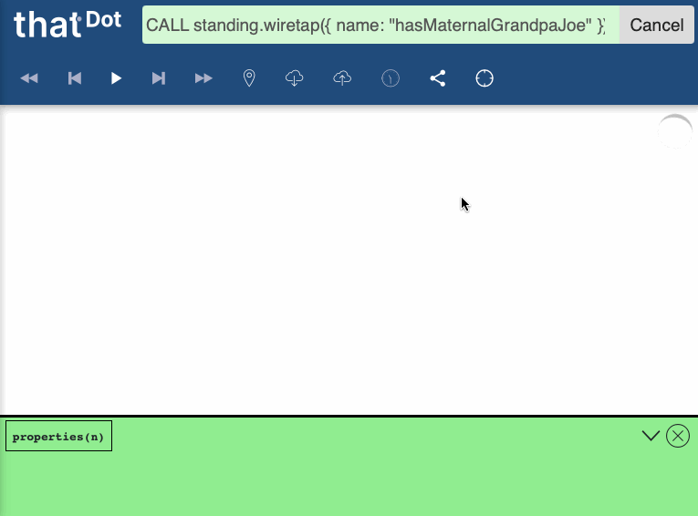

# Writing Standing Queries

@@@ index

* @ref:[Experimental `MultipleValues` mode](multiple_values.md)

@@@

A _Standing Query_ is a query that matches some graph structure incrementally while new data is written in. Standing queries report results when the full pattern has been found.

Seeing which Standing Queries are currently running, or adding/removing a Standing Query is all done through the REST API, by the endpoints under the "Standing Queries" section in the docs pages shipped with each instance of Quine.

## Syntax and Structure

The first step to making a Standing Query is determining what the graph pattern is that you want to watch for. This pattern is expressed using a subset of the same Cypher language that is used for regular queries. The reasoning behind this is that the (unordered) set of positive matches, minus the set of negative matches (ie, cancellations) produced by a standing query over a period of time should be the same as the matches produced if the same Cypher query had been issued in a non-standing fashion after all data has been written in.

Standing queries have two parts: a "match" query and an "output". The "match" portion defines the structure of what we're looking for. The "output" defines an action to take for each result produced by the "match" query.

The "match" query describes a graph pattern that is matched incrementally on every node that gets loaded up into the system. Every such query has one node which is the "root" of the pattern: this is the node whose ID is returned by the "match" query. The "root" is where the pattern matching process begins, and the "root" ID is delivered as a result to the "output" when the pattern starting at that root is completed.

### Match query

The "match" portion of a Standing Query is a declarative graph pattern. This pattern is usually expressed using a subset of the Cypher query language. For example:

```cypher
// Locate people with a maternal grandpa "Joe"
MATCH (person)-[:has_mother]->(mom)-[:has_father]->(grandpa { name: "Joe" })
WHERE exists(person.name) AND exists(mom.name)
RETURN DISTINCT strId(person) AS id
```

Standing queries must only contain a `MATCH` and a `RETURN`, with an optional `WHERE` in between. Additionally, when running with the default `DistinctId` mode (see the `"mode"` field in the `/api/v1/query/standing/{name}/issue` endpoint), the following additional constraints apply:

  1. Each node inside the `MATCH` may have: an optional node variable name, an optional label (but not more than one label per node), an optional map of literal property values to match. For example, `(grandpa { name: "Joe" })` from the example query above binds the variable `grandpa` and specifies the literal property values `{ name: "Joe" }`.

  2. Nodes in the `MATCH` must form a @link:[connected graph](https://en.wikipedia.org/wiki/Connectivity_(graph_theory)).

  3. Nodes in the `MATCH` must not contain any cycles. In other words, the pattern must be either linear or tree-shaped.

  4. The only variables that can be bound in the query must be nodes in the `MATCH` - edges cannot be aliased to a variable and path expressions cannot be used (so `-[:has_father]->` is fine, but `-[e:has_father]->` is not).

  5. Edges in the `MATCH` must be directed, have exactly one edge label, and cannot be variable-length.

  6. Constraints inside the `WHERE` clause must all be `AND`-ed together and of one of the following forms:

     * `nodeName.property = 123` - the property has the literal value on the right
     * `nodeName.property <> 123` - the property must exist but be different than the literal value on the right
     * `exists(nodeName.property)` - the property must exist
     * `NOT exists(nodeName.property)` - the property must not exist
     * `nodeName.property =~ "regex"` - the property must be a string matching the regex

  7. Exactly one value may be returned, and it must be either the (`DISTINCT`) `id` or `strId` of a node bound in the `MATCH`. For example, `RETURN DISTINCT strId(n)` or `RETURN DISTINCT id(n) as nId` are OK, but not `RETURN n.name` or `RETURN id(n) AS nId`. The node whose id is returned is the "root" node - the location where the pattern starts being incrementally matched. (Historically, `DistinctId` queries did not require a `DISTINCT` keyword, but `DistinctId` patterns without `DISTINCT` are deprecated and will be removed in a future version).

@@@ note

Several of the restrictions above are already in the process of being loosened and can be previewed using the @ref:[currently-experimental `MultipleValues` mode](multiple_values.md):

  1. Multiple values can be returned in the `RETURN`, including ones that aren't IDs

  2. Constraints in the `WHERE` clause can be more general

While `DISTINCT` is required for `DistinctId` Standing Queries, the `MultipleValues` mode does not currently support `DISTINCT` return values.

The following restrictions will also be lifted in the near future:

  1. Edges will support: multiple labels (or none), no direction, and variable-lengths

  2. Graph patterns won't need to be free of cycles

  3. It will be possible to bind edges and paths to variables

@@@

### Output action

Once you've decided what graph structure to watch for, the second half of a Standing Query is deciding what to do with the results. This step can be initially skipped as Standing Query outputs can always be added even after the query is running, with the `/api/v1/query/standing/{name}/output` endpoint. The information that is produced for each result includes:

 1. Query data returned from the "match" portion (e.g. the ID of the node). This is structured as an object whose keys are the names of the values returned (ex: `RETURN DISTINCT strId(n)` would have key `"strId(n)"` and `RETURN DISTINCT id(n) AS theId` would have key `"theId"`). The intuition is that each query data returned is analogous to a row returned from a regular Cypher query - the key names match what would normally be Cypher column names.

 2. Meta information

    * `isPositiveMatch`: whether the result is a new match. When this value is false, it signifies that a previously matched result no longer matches

    * `resultId`: a UUID generated for each result. This is useful if you wish to track a result in some external system, since the `resultId` of the result with `isPositiveMatch = false` will match the `resultId` of the original result (when `isPositiveMatch = true`).

A result is emitted when the pattern matches or when it stops matching, but extra results won't be emitted if there are new ways the pattern can match.

@@@ note { title='Example of single-result per root semantics' }

Consider the following query for watching friends.

```cypher
// Find people with friends
MATCH (n:Person)-[:friend]->(m:Person)
RETURN DISTINCT strId(n)
```

If we start by creating disconnected "Peter", "John", and "James" nodes, there will be no matches.

```cypher
CREATE (:Person { name: "Peter" }),
       (:Person { name: "John" }),
       (:Person { name: "James" })
```

Then, if we add a "friend" edge from "Peter" to "John", "Peter" will trigger a new Standing Query match.

```cypher
MATCH (peter:Person { name: "Peter" }), (john:Person { name: "John" })
CREATE (peter)-[:friend]->(john)
```

However, adding a second "friend" edge from "Peter" to "James", "Peter" will not trigger a new match since he is already matching (that is, the "Peter" node is not distinct).

```cypher
MATCH (peter:Person { name: "Peter" }), (james:Person { name: "James" })
CREATE (peter)-[:friend]->(james)
```

@@@

There are pre-built output adapters for at least the following (this list is continually growing—refer to the Standing Query section of the @ref:[REST API](../reference/rest_api.md) for an exhaustiv list):

  * publishing to a Kafka topic
  * publishing to an AWS Kinesis stream
  * publishing to AWS SQS and SNS
  * logging to a file
  * `POST`-ing results to an HTTP endpoint
  * executing another Cypher query

The last of these options is particularly powerful, since it makes it possible to mutate the graph in a way that can trigger another Standing Query result into any other output adapter. This makes it possible to post-process results to collect more information from the graph or to filter out matches that don't meet some requirement.

#### Cypher Query as an Output

The Cypher query output is defined in terms of a regular Cypher query that is run for each result produced by the Standing Query. <!--The results from the Standing Query are available under a Cypher query parameter—see the __ref [3D data tutorial]  ../../tutorials/3d_data_ingest_sq.md   for an end-to-end example of this. --> To make sure the query is correct and the desired results are matched, it is highly recommended that the output query be tested independently in the Exploration UI.

## Inspecting Running Queries

Since Standing Queries use a subset of regular Cypher query syntax, the Standing Query itself can be run as a regular query either to see what data already in the graph would have been matched by the query or to understand why a particular node in the graph is not a match. When doing so, you should constrain the starting points of the query if there is already a large amount of data in the system (see @ref:[querying infinite data](querying_infinite_data.md)).

In addition, there are a couple ways to "wiretap" results as they are being produced and inspect them live. These are meant primarily as debug mechanisms - not substitutes for outputs.

### `standing.wiretap` Cypher procedure

From the @ref:[Exploration UI](exploration_ui.md), the `standing.wiretap` Cypher procedure can be used to issue a query that will incrementally return results. Since this is just a regular, Cypher procedure, it can feed its outputs automatically into another query too. For example:

```cypher
// Wiretap "hasMaternalGrandpaJoe" and return properties of matching nodes
CALL standing.wiretap({ name: "hasMaternalGrandpaJoe" }) YIELD meta, data
WHERE meta.isPositiveMatch
MATCH (n) WHERE id(n) = data.id
RETURN properties(n)
```

Then, you will see results incrementally appear as they match. When you are satisfied, you can cancel the query.



@@@ warning

The `standing.wiretap` procedure only stops running if the standing query is cancelled (since otherwise it can never be certain that there won't be more forthcoming match results). This means that it is risky to use the procedure in the Cypher REST API or in other places where results are not reported incrementally and queries cannot be cancelled.

@@@

### SSE endpoint

It is also possible to wiretap results outside of the Exploration UI (and without going through the `standing.wiretap` Cypher procedure) by using the SSE endpoint `/api/v1/query/standing/{standingQueryName}/results`. That endpoint will surface new matches as they are being produced. The Chrome web browser, for example, will continue to append new results to the bottom of the page as they become available. `curl` will print out new results as they arrive.

```bash
$ curl http://localhost:8080/api/v1/query/standing/hasMaternalGrandpaJoe/results
data:

data:

data:{"data":{"id":"2756309260014435"},"meta":{"isInitialResult":true,"ispositivematch":true,"resultId":"8f408026-8fb3-3955-c81a-7259175f41b8"}}
event:result
id:8f408026-8fb3-3955-c81a-7259175f41b8

data:{"data":{"id":"7945274922095468"},"meta":{"isInitialResult":true,"isPositiveMatch":true,"resultId":"6a83dda3-08a1-e085-ee7d-14138398f336"}}
event:result
id:6a83dda3-08a1-e085-ee7d-14138398f336

data:{"data":{"id":"6994090876991233"},"meta":{"isInitialResult":true,"isPositiveMatch":true,"resultId":"59b215b4-4084-b5bb-379d-9654bb2a7c83"}}
event:result
id:59b215b4-4084-b5bb-379d-9654bb2a7c83

data:
```

Using the output above, it is possible to query the matching nodes directly with a Cypher query. For instance, we can go look for current children of some of the matches the SSE output above tells us we found:

```cypher
// Query for children of nodes with IDs from the SSE endpoint above
UNWIND [2756309260014435, 7945274922095468, 6994090876991233] AS personId
MATCH (person)<-[:has_mother|:has_father]-(child) where id(person) = personId
RETURN person.name, child.name, child.yearBorn
```

Querying for a matched node is especially useful if there is a Cypher query registered as one of the outputs of the Standing Query and if that second query modifies the data—for instance, adding an edge connected to the node.