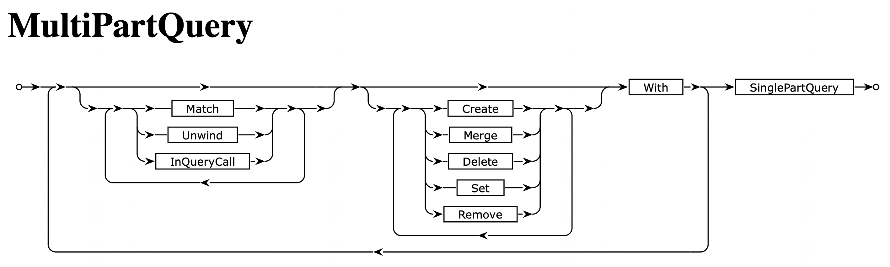

# Cypher Language

@@@index
* @ref:[Cypher Functions](cypher_functions.md)
* @ref:[Cypher Procedures](cypher_procedures.md)
@@@


Cypher is the most widely use query language for interacting with data in a property graph format. It is structurally and syntactically similar to SQL, with the main difference being the `MATCH` clause. The idea of `MATCH` is to focus on declaratively describing the graph shape (pattern) that you want and then to let the query compiler pick a good execution plan. What would normally require multiple `JOIN`s in a relational model often just reduces to one `MATCH` with a pattern that has multiple edges:

```cypher
MATCH (n: Person)-[:has_parent]->(p: Person)-[:lives_in]->(c: City)
RETURN p.name AS name, c.name AS parentsCity
```

Compare the above Cypher to the equivalent SQL below:

```sql
SELECT n.name AS name, c.name AS parentsCity
FROM persons AS n
JOIN persons AS p ON n.parent = p.id
JOIN cities AS c ON p.city = c.id
```

Cypher queries are used in Quine for several purposes:

  * Used to ingest events and create the graph
  * Set as standing queries to find live matches from the dynamically changing graph
  * Entered in the query bar of the @ref:[Exploration UI](../../getting_started/exploration_ui.md)
  * Set as "quick queries" in the @ref:[Exploration UI](../../getting_started/exploration_ui.md)
  * Sent directly through the @ref:[REST API](../rest_api.md)


## Railroad Diagrams
@link:[Interactive railroad diagrams](https://s3.amazonaws.com/artifacts.opencypher.org/M18/railroad/Cypher.html){ open=new } for the Cypher language syntax are a helpful tool. Example:




## Language Specification
@link:[The official OpenCypher language reference here](https://s3.amazonaws.com/artifacts.opencypher.org/openCypher9.pdf){ open=new }.

## Unsupported Language Features
Almost all of the Cypher language is supported with a few notable exceptions:

- Nodes found in a Cypher `MATCH` statement do not include updates made in the same query following the match statement. Some particular cases where this tends to be more surprising are:
   - When updating a node's labels or properties with `SET n :MyLabel`, `SET n.foo = "bar"`, or `SET n += propertyMap`, the `n` variable representing the node will not reflect the update.
   - The same node can be aliased under two different names at two different and those two aliases may be different if there have been intervening changes.
- The identity of an edge in Quine is determined entirely by the direction, label, and endpoints of the edge. This has several implications:
   - Edges do not have IDs. A query like `MATCH (n)-[e]->(m) RETURN id(e)` does not return a useful value. Looking up edges must be done from one of the nodes on either side.
   - There cannot be multiple edges with the same label and direction connecting the same two nodes. If a query such as `MATCH (n), (m) WHERE id(n) = idFrom(0) AND id(m) = idFrom(1) CREATE (n)-[:myEdge]->(m)` is run twice, the second `CREATE` will have no effect since the single possible edge already exists.
   - Properties on edges are not supported. Edges can always be equally represented as an `edge-node-edge` instead of just an `edge`. The node in the middle becomes the carrier for properties that are about the relationship. Quine does not suffer from graph traversal challenges that sometimes motivate users to limit query length, so this node amplification is not problematic in Quine.
- The runtime characteristics of setting a node label are exactly equivalent to using a property. Querying using labels does not enable more efficient scanning, it is just an additional filter condition. Even if there are only a handful of nodes with the `:Person` label on them, a query such as `MATCH (p:Person) RETURN DISTINCT p.name` will still need to scan all nodes to find those with the desired `:Person` label.
- `DETACH DELETE` does not work on a path.
- `shortestPath` and `allShortestPaths` cannot be used inside a `MATCH`/`MERGE` pattern - they can only be used as expressions returning a path, or list of paths.
- Some aggregation functions are not yet implemented: `percentileCont`, `percentileDisc`, `stDev`, and `stDevP`. 
- `sum` and `avg` do not work on durations.
- Hints inside queries (an advanced Cypher feature) are not supported and are silently ignored.
- Cypher commands are not supported (used for system management in other systems).

## See Also:
- @ref:[Cypher Functions](cypher_functions.md)
- @ref:[Cypher Procedures](cypher_procedures.md)
