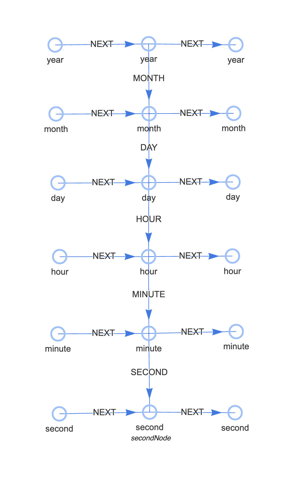
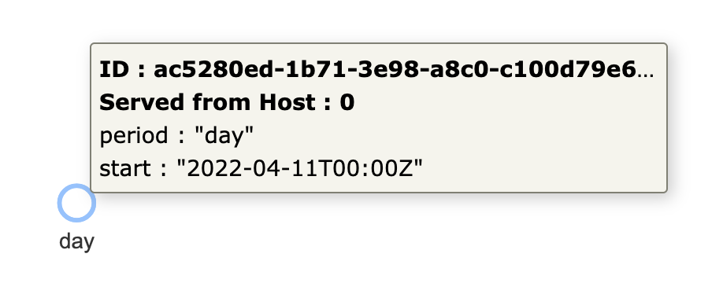
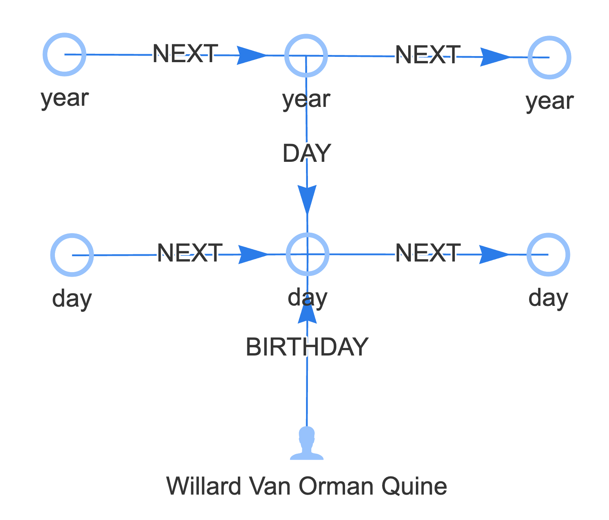

# Time Reification

`reify.time` is a Cypher procedure included with Quine. Its purpose is to facilitate the instantiation (reification) of
a graph of nodes representing time. `reify.time` is provided with a timestamp (current wall clock time as the default),
and a list of time periods. It adds time nodes representing that point in time at each period's level of precision.
It returns the node representing that point in time for the smallest among the given periods. `reify.time` does this by
determining which nodes must exist, and either reading them from the graph or creating them as necessary. Additionally,
`reify.time` relates the nodes it makes to each other and other nodes previously created by this function.

`reify.time` does not do anything Cypher can't do. In this sense, reify.time is unnecessary. So why does it need to exist?

* To reduce the boilerplate necessary to ingest time-series data usefully
* To create a modification point where in the future, changes can be made to how time-series data is modeled in the graph and have this change applied to all usages
* To organize data to be more useful in the Quine web UI
* To settle on a unified convention for representing time so that users don’t have to spend brainpower to create something bespoke (and inconsistent among different users)
* To create the persistent graph structure upon which time-series aggregate values can be stored or related

`reify.time` builds a hierarchy of related nodes for a single datetime value. Each node in this hierarchy represents a different period where the input datetime value belongs. 

* Each node in the hierarchy is defined by a start datetime value and a period. 
* Each node in the hierarchy is related to its parent node (except the largest). 
* Each node in the hierarchy is also related to the next node in time (and the same period).

If you want to find a node created by `reify.time` in a later query, call it again with the datetime and the period of
the node you want.

## Supported Parameters

* ZonedDateTime (optional; defaults to now)
* Periods (optional list of strings; defaults to all periods)

Periods are:

* year
* month
* day
* hour
* minute
* second

## Return Values

`reify.time` returns the smallest period time node reified by this function. This function creates time nodes that do not exist and reuses time nodes that already exist.

## Examples

Call `reify.time` with default arguments, which will be to reify time nodes at all periods for the current system clock time:

```cypher
CALL reify.time() YIELD node AS secondNode RETURN secondNode
```



Run with a time parsed from a string:

```cypher
CALL reify.time(datetime("2022-04-11T11:06:12Z"), ["month", "day"]) YIELD node AS dayNode RETURN dayNode
```



Reify Willard Van Orman Quine's birthday at the year and day level, then create a node representing Quine himself with
an edge to his birthday at the day level. Match the adjacent nodes created at all levels by reify.time to return
everything created by this query.

```cypher
CALL reify.time(datetime("1908-06-25T08:27:42-05:00"), ["year", "day"]) YIELD node AS dayNode
MATCH (q)
WHERE id(q) = idFrom("Quine")
SET q:Person, q.name = 'Willard Van Orman Quine'
CREATE (q)-[:BIRTHDAY]->(dayNode)
WITH dayNode AS birthday
MATCH
  (quine)-[:BIRTHDAY]->(birthday)<-[:DAY]-(birthyear {period: 'year'}),
  (previousYear)-[:NEXT]->(birthyear)-[:NEXT]->(nextYear),
  (previousDay)-[:NEXT]->(birthday)-[:NEXT]->(nextDay)
RETURN quine, previousYear, birthyear, nextYear, previousDay, birthday, nextDay
```



Use within a Recipe:

@@snip [template-recipe.yaml]($quine$/recipes/wikipedia.yaml)

The above Recipe consumes an event stream that describes new Wikipedia pages. Each event includes a timestamp, which is passed to `reify.time`.
